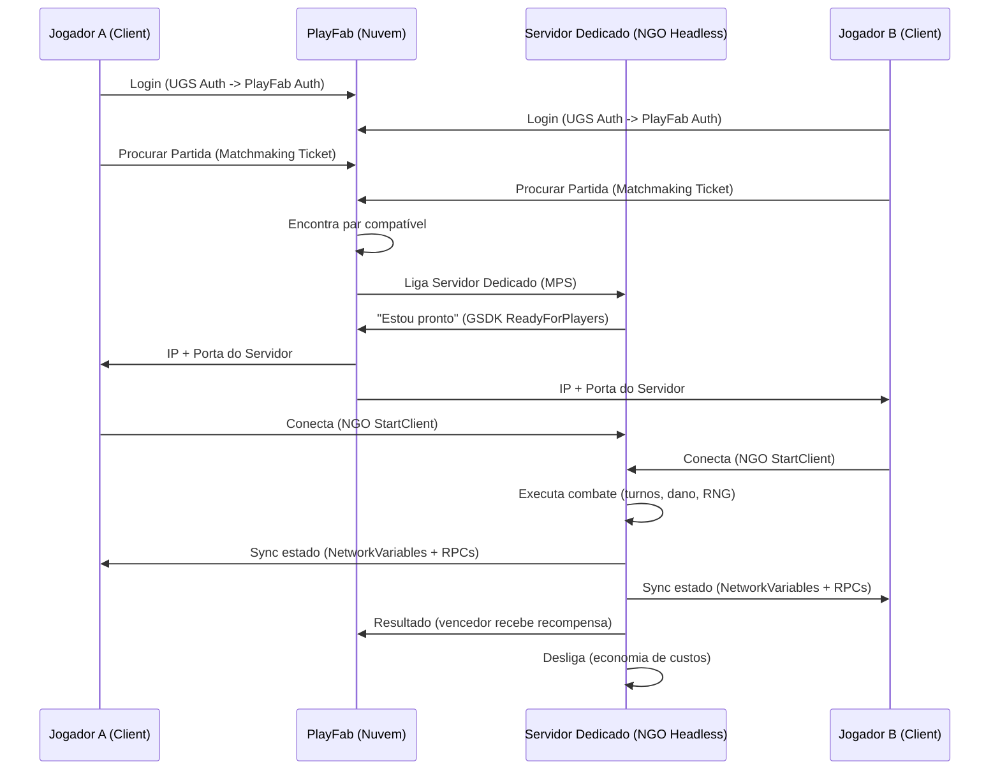

# Plano de Arquitetura Revisado: Celestial-Cross Online

> Revisão aprofundada baseada em análise real do código-fonte e pesquisa das tecnologias atuais (Julho 2026).

---

## 📋 Resumo das Decisões (Aprovadas)

| Aspecto | Escolha |
|---------|---------|
| **Topologia de Rede** | Servidor Dedicado Autoritativo (Opção A) |
| **Backend / Contas** | Abordagem Híbrida (UGS para Auth/Saves + PlayFab para Economy/MPS) |
| **Geração Procedural** | Migrada para o Servidor (Prioridade - Fase 1) |
| **Netcode** | Unity Netcode for GameObjects (NGO v2.12+) |
| **Hospedagem PvP** | PlayFab Multiplayer Servers (MPS) — Linux Containers |
| **Matchmaking** | PlayFab Matchmaking (Tickets → Queues → Rules) |

---

## 🌐 Como funciona a Hospedagem Online



**Duas Versões do Jogo:**
- **Client Build**: O APK/app normal com gráficos, UI e som.
- **Server Build (Headless)**: Versão sem gráficos que roda a lógica pura de combate. Compilada para **Linux** e hospedada como **container Docker** no PlayFab MPS (Azure).

---

## 🔍 Análise do Código Atual — O que muda e o que não muda

Analisei todos os sistemas do projeto em profundidade. Aqui está o impacto real:

### ✅ Sistemas que NÃO precisam mudar

| Sistema | Arquivos-chave | Razão |
|---------|---------------|-------|
| **IAP** | `IAPStoreManager.cs` | Compras acontecem fora da partida |
| **Data Layer** | `UnitCatalog.cs`, ScriptableObjects | Dados são read-only e já estão no build |
| **Storage** | `IStorageProvider.cs`, `LocalStorageProvider.cs` | Excelente abstração; UGS Cloud Save continua sendo usado para persistência básica |
| **UI geral** | Menus, Hub | Apenas precisam de uma nova tela de "Matchmaking/PvP" |

### ⚠️ Sistemas que precisam de ADAPTAÇÃO

| Sistema | Arquivos-chave | Impacto |
|---------|---------------|---------|
| **Auth** | `AuthManager.cs` | Integrar UGS Auth com PlayFab (vincular a conta UGS ao ID do PlayFab) |
| **Account** | `AccountManager.cs`, `Account.cs` | Sincronizar itens, pets e artefatos gerados no PlayFab de volta para a Account local |
| **Game Flow** | `GameFlowManager.cs`, `PhaseManager.cs` | Novo fluxo PvP: Hub → Matchmaking → Battle |
| **Placement** | `PlacementManager.cs` | Modo dual: ambos jogadores posicionam unidades simultaneamente |
| **BattleLevel** | `BattleLevelBuilder.cs` | Caminho alternativo para partidas PvP |

### 🔴 Sistemas que precisam de REFATORAÇÃO PROFUNDA (Áreas Críticas)

| Sistema | Arquivos-chave | Problema |
|---------|---------------|---------|
| **Geração Procedural** | `GachaService.cs`, `ArtifactGenerator.cs`, `Pets` | 100% do RNG de Gacha, Pets e Artefatos ocorre no cliente. **DEVE** ser migrado para Azure Functions. |
| **TurnManager** | `TurnManager.cs` | Singleton fortemente acoplado. Para PvP, o turno do oponente precisa vir da rede. |
| **PlayerController**| `PlayerController.cs` | Lê `Input` diretamente. Precisa de abstração "local vs remoto" (Command Pattern). |
| **DamageProcessor** | `DamageProcessor.cs` | Usa `Random.Range()` para crits. **DEVE** usar PRNG com seed sincronizada na rede. |
| **PassiveManager**  | `PassiveManager.cs` | Hook pipeline complexo. A execução precisa ser idêntica no servidor e clientes. |

---

> [!WARNING]
> ### Abordagem Híbrida para Economia
> Você já tem UGS Authentication + Cloud Save. O modelo adotado será manter o **UGS** para Login e Saves base, integrando com o **PlayFab** via vinculação de conta. O PlayFab lidará **apenas** com as áreas onde é superior: Economy v2, Matchmaking e Multiplayer Servers (MPS).

> [!IMPORTANT]
> ### Servidor Autoritativo (Decisão de Arquitetura)
> A opção escolhida foi **Servidor Autoritativo Puro**. O servidor roda TODA a lógica de combate. Os clientes enviam apenas comandos ("mover X para Y", "usar Z"). O servidor executa, valida, e envia o resultado de volta. 

---

## 🚀 Plano de Implementação Detalhado

### Fase 0: Preparação e Infraestrutura (1-2 semanas)

#### 0.1 — Criar conta PlayFab e configurar projeto
- Criar conta em [playfab.com](https://playfab.com).
- Configurar moedas virtuais (`Money`, `Stardust`, `StarMaps`).

#### 0.2 — Instalar SDKs no projeto Unity
- **PlayFab SDK v2 (Unified):** Adicionar via Package Manager.
- **Unity NGO:** Window → Package Manager → "Netcode for GameObjects" (v2.12+).
- **PlayFab GSDK:** Baixar e importar na pasta Assets.

---

### Fase 1: Geração Procedural no Servidor (Prioridade Inicial)

A migração do RNG para o servidor. O `GachaService.cs` e `ArtifactGenerator.cs` não devem mais determinar os itens sorteados localmente.

#### 1.1 — Infraestrutura de Cloud Functions no Unity
- Criar `PlayFabCloudFunctionCaller.cs` genérico para chamar as Azure Functions.
- Refatorar a inicialização em `GachaService.cs` para utilizar a nuvem por padrão.

#### 1.2 — Migração do Gacha
- Criar `CloudGachaProvider : IGachaProvider`.
```csharp
[Cliente] → PlayFab CloudScript: "ExecuteGachaPulls(bannerId, quantity)"
                    ↓
[Azure Function] → Verifica saldo → Calcula pity → Sorteia itens
                    → Debita moedas → Atualiza Inventário → Retorna resultado
                    ↓
[Cliente] ← Recebe resultado final → Exibe animação de pull
```

#### 1.3 — Migração de Artefatos e Pets
- Criar `CloudArtifactGenerator.cs` substituindo `ArtifactGenerator.GetRandomSubstatType` etc.
- Criar `CloudPetGenerator.cs` para gerar IVs/Status do `RuntimePetData` no servidor.

---

### Fase 2: Refatoração do Combate para Rede (3-5 semanas) ⚠️

#### 2.1 — Command Pattern (Abstrair Inputs)
Criar um sistema de comandos serializáveis para substituir a leitura direta de `Input`:
```csharp
[Serializable]
public abstract class CombatCommand { ... }

[Serializable]
public class MoveCommand : CombatCommand { public Vector2Int TargetTile; }
```
- **PvE Local:** Produz comando → executa.
- **PvP Online:** Produz comando → envia `ServerRpc` → executa → recebe via `ClientRpc`.

#### 2.2 — RNG Determinístico
Criar PRNG para o combate:
```csharp
public class CombatRNG {
    private System.Random _rng;
    public CombatRNG(int seed) { _rng = new System.Random(seed); }
    public float Range(float min, float max) => ...
}
```
Substituir **todos** os usos de `Random.Range` em `DamageProcessor` e `PassiveManager` por chamadas do `CombatRNG`.

#### 2.3 — Networkizar o TurnManager
```csharp
public class TurnManager : NetworkBehaviour {
    public NetworkVariable<int> CurrentUnitIndex = new();
    
    [ServerRpc]
    public void SubmitCommandServerRpc(CombatCommand command) {
        // Valida e executa
    }
}
```

#### 2.4 — Modo de Jogo Dual
Criar `CombatMode { PvE_Local, PvP_Online }` para alternar entre simulação local vs conectada.

---

### Fase 3: Servidor Dedicado e Matchmaking (2-3 semanas)

#### 3.1 — PlayFab Server Manager
```csharp
public class PlayFabServerManager : MonoBehaviour {
    void Start() {
        #if UNITY_SERVER
        PlayFabMultiplayerAgentAPI.Start();
        ...
        PlayFabMultiplayerAgentAPI.ReadyForPlayers();
        #endif
    }
}
```

#### 3.2 — Fluxo de Matchmaking
```csharp
var ticket = await PlayFabMultiplayerAPI.CreateMatchmakingTicketAsync(...);
MatchmakingTicketResult match = await PollForMatch(ticket.TicketId);
// Conectar ao NGO Transport com o IP e Porta do match
```

#### 3.3 — Linux Dedicated Build
Configurar build Headless, empacotar em Docker e subir para Azure MPS.

---

### Fase 4: PlacementManager PvP e Polish (2-3 semanas)

- **Placement Dual:** Refatorar `PlacementManager.cs` para jogadores configurarem posições simultaneamente e enviarem `Ready` ao servidor.
- **UI PvP:** Nova tela de Arena, animações de fila e pareamento.

---

## 🔴 Maiores Riscos e Desafios

| Risco | Severidade | Mitigação |
|-------|-----------|-----------|
| **TurnManager** quebrar o PvE | 🔴 Alta | Usar `CombatMode` enum e isolar a lógica online. |
| **Hooks/Passivas** desincronizarem | 🔴 Alta | A Opção A resolve isso: apenas o servidor resolve as passivas e transmite o resultado visual. |
| **Esquecer `Random.Range()`** | 🟡 Média | `grep` rigoroso em todo o código para remover a função local do Unity nas sessões de combate. |
| **Custos MPS** escalando | 🟡 Média | Configurar autoshutdown imediato no GSDK e usar VMs Dasv4. |

---

## 📊 Estimativa de Esforço

| Fase | Duração Estimada | Dependência |
|------|-----------------|-------------|
| **Fase 0:** Infraestrutura | 1 semana | — |
| **Fase 1:** Geração Procedural Cloud | 1-2 semanas | Fase 0 |
| **Fase 2:** Refatoração Combate | 3-4 semanas | Fase 0 |
| **Fase 3:** Matchmaking / Server | 2 semanas | Fases 1+2 |
| **Fase 4:** Polish e Placement | 2 semanas | Fase 3 |
| **Total Estimado** | **9-11 semanas** | — |

> **Próximo Passo Imediato:** Iniciar a Fase 1 (Criação das interfaces de nuvem para Gacha, Pets e Artefatos).
