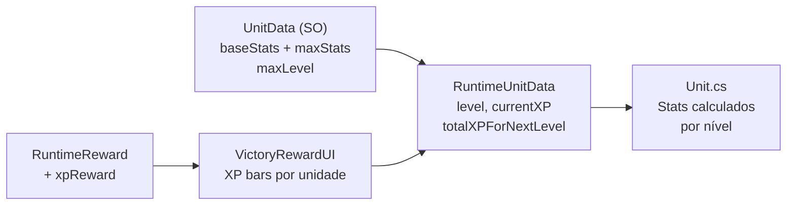

# Plano 1: Sistema de Nível de Unidades

## Visão Geral
Criar um sistema de progressão onde unidades ganham XP ao completar batalhas, sobem de nível, e seus atributos escalam linearmente entre valores base e máximos.

## Arquitetura



---

## Proposed Changes

### Componente 1: Data Layer (Persistência)

#### [MODIFY] [UnitData.cs](file:///d:/Arquivos/Documentos/GitHub/Bichinhos-Magicos/Assets/Celestial-Cross/Scripts/Unit/Base/UnitData.cs)
- Adicionar `maxStats` (`CombatStats`) — atributos no nível máximo
- Adicionar `maxLevel` (`int`, default 60)
- Adicionar método `GetStatsAtLevel(int level)` que interpola linearmente:
  ```
  stat(lv) = baseStat + (maxStat - baseStat) * (level - 1) / (maxLevel - 1)
  ```

#### [MODIFY] [RuntimeUnitData.cs](file:///d:/Arquivos/Documentos/GitHub/Bichinhos-Magicos/Assets/Celestial-Cross/Scripts/Data/RuntimeUnitData.cs)
Adicionar campos:
```csharp
public int Level = 1;
public int CurrentXP = 0;
```

#### [NEW] [LevelingConfig.cs](file:///d:/Arquivos/Documentos/GitHub/Bichinhos-Magicos/Assets/Celestial-Cross/Scripts/Unit/Character/LevelingConfig.cs)
ScriptableObject com a curva de XP global:
```csharp
[CreateAssetMenu(menuName = "Celestial Cross/Config/Leveling Config")]
public class LevelingConfig : ScriptableObject
{
    public int baseXPPerLevel = 100;     // XP para level 2
    public float xpGrowthFactor = 1.15f; // Multiplicador por nível
    
    public int GetXPForLevel(int level) =>
        Mathf.RoundToInt(baseXPPerLevel * Mathf.Pow(xpGrowthFactor, level - 1));
}
```

---

### Componente 2: Combat Stats Calculation

#### [MODIFY] [Unit.cs](file:///d:/Arquivos/Documentos/GitHub/Bichinhos-Magicos/Assets/Celestial-Cross/Scripts/Unit/Base/Unit.cs)
- No getter `Stats`, substituir `unitData.baseStats` por `unitData.GetStatsAtLevel(runtimeUnitData.Level)`
- Receber `RuntimeUnitData` na inicialização (via `UnitRuntimeConfigurator` ou `Initialize`)

---

### Componente 3: XP em Rewards

#### [MODIFY] [RewardPackage.cs](file:///d:/Arquivos/Documentos/GitHub/Bichinhos-Magicos/Assets/Celestial-Cross/Scripts/System/RewardPackage.cs)
- Adicionar `public int XP;`

#### [MODIFY] [RuntimeReward.cs](file:///d:/Arquivos/Documentos/GitHub/Bichinhos-Magicos/Assets/Celestial-Cross/Scripts/Data/Dungeon/RuntimeReward.cs)
- Adicionar `public int XP;`
- No construtor com `RewardPackage`, copiar `XP = basePackage.XP`

---

### Componente 4: Distribuição de XP

#### [NEW] [XPDistributor.cs](file:///d:/Arquivos/Documentos/GitHub/Bichinhos-Magicos/Assets/Celestial-Cross/Scripts/Combat/XPDistributor.cs)
Classe estática chamada ao fim do combate:
```csharp
public static class XPDistributor
{
    public static Dictionary<string, XPGainResult> DistributeXP(
        int totalXP, List<Unit> participatingUnits, LevelingConfig config)
    {
        int xpPerUnit = totalXP / participatingUnits.Count;
        // Para cada unidade: adicionar XP, checar se subiu de nível
        // Retornar um dicionário [unitID → XPGainResult]
    }
}

public class XPGainResult
{
    public int xpGained;
    public int oldLevel;
    public int newLevel;
    public int currentXP;
    public int xpToNextLevel;
}
```

---

### Componente 5: Victory Screen UI

#### [MODIFY] [VictoryRewardUI.cs](file:///d:/Arquivos/Documentos/GitHub/Bichinhos-Magicos/Assets/Celestial-Cross/Scripts/Giulia_UI/VictoryRewardUI.cs)
- Receber `Dictionary<string, XPGainResult>` de `XPDistributor`
- Mostrar seção de XP com:
  - Ícone da unidade + nome
  - Barra de XP animada (fill)
  - Texto "Lv.X → Lv.Y" se subiu de nível
  - Texto "+{xp} XP"

#### [NEW] [UIBuilder_VictoryXPPanel.cs](file:///d:/Arquivos/Documentos/GitHub/Bichinhos-Magicos/Assets/Celestial-Cross/Scripts/Giulia_UI/Editor/UIBuilder_VictoryXPPanel.cs)
MenuItem que gera o painel de XP no Canvas da cena:
- Para cada slot de unidade (max 4): ícone + barra fill + texto
- Vincula automaticamente ao VictoryRewardUI

---

### Componente 6: Inventory UI

#### [MODIFY] [InventoryUI.cs](file:///d:/Arquivos/Documentos/GitHub/Bichinhos-Magicos/Assets/Celestial-Cross/Scripts/Giulia_UI/InventoryUI.cs)
- No painel superior da aba Unidades, mostrar:
  - Nível atual (`Lv. {level}`)
  - Barra de XP (fill image)
  - Texto `{currentXP} / {xpToNext}`

---

## Verificação

- [ ] Criar uma `LevelingConfig` SO de teste
- [ ] Conferir que `UnitData.GetStatsAtLevel(1)` = `baseStats` e `GetStatsAtLevel(maxLevel)` = `maxStats`
- [ ] Simular uma batalha e verificar que `RuntimeUnitData.Level` sobe
- [ ] Verificar que `VictoryRewardUI` mostra barra de XP animated
- [ ] Verificar que `InventoryUI` mostra nível e barra
