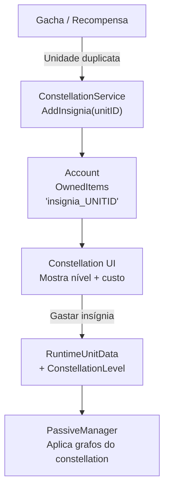

# Plano 2: Sistema de Constelações

## Visão Geral
Quando o jogador recebe uma unidade **duplicata**, em vez de ganhar a unidade novamente, recebe uma **Insígnia Estelar** daquela unidade. Gastar insígnias (1 por nível de constelação) desbloqueia novas habilidades passivas (via `AbilityGraphSO`).

## Arquitetura



---

## Proposed Changes

### Componente 1: Data

#### [MODIFY] [RuntimeUnitData.cs](file:///d:/Arquivos/Documentos/GitHub/Bichinhos-Magicos/Assets/Celestial-Cross/Scripts/Data/RuntimeUnitData.cs)
```csharp
public int ConstellationLevel = 0; // 0-6 (max 6 constelações)
```

#### [MODIFY] [UnitData.cs](file:///d:/Arquivos/Documentos/GitHub/Bichinhos-Magicos/Assets/Celestial-Cross/Scripts/Unit/Base/UnitData.cs)
Adicionar:
```csharp
[Header("Constellation Passives")]
[Tooltip("Grafos passivos desbloqueados por nível de constelação (índice 0 = C1, índice 5 = C6)")]
public List<AbilityGraphSO> constellationPassives = new();
```

---

### Componente 2: Service Layer

#### [NEW] [ConstellationService.cs](file:///d:/Arquivos/Documentos/GitHub/Bichinhos-Magicos/Assets/Celestial-Cross/Scripts/System/ConstellationService.cs)
```csharp
public static class ConstellationService
{
    public const int MAX_CONSTELLATION = 6;
    
    public static string GetInsigniaItemID(string unitID) => $"insignia_{unitID}";
    
    // Chamado quando jogador recebe unidade duplicata
    public static void HandleDuplicateUnit(Account account, string unitID)
    {
        account.AddItem(GetInsigniaItemID(unitID), 1);
    }
    
    // Tenta subir constelação (custa 1 insígnia por nível)
    public static bool TryUpgradeConstellation(Account account, RuntimeUnitData unitData)
    {
        if (unitData.ConstellationLevel >= MAX_CONSTELLATION) return false;
        string insigniaID = GetInsigniaItemID(unitData.UnitID);
        if (!account.RemoveItem(insigniaID, 1)) return false;
        unitData.ConstellationLevel++;
        return true;
    }
    
    // Retorna os grafos passivos desbloqueados para o nível atual
    public static List<AbilityGraphSO> GetUnlockedPassives(UnitData soData, int constellationLevel)
    {
        var result = new List<AbilityGraphSO>();
        for (int i = 0; i < constellationLevel && i < soData.constellationPassives.Count; i++)
        {
            if (soData.constellationPassives[i] != null)
                result.Add(soData.constellationPassives[i]);
        }
        return result;
    }
}
```

---

### Componente 3: Integração com o Unit

#### [MODIFY] [Unit.cs](file:///d:/Arquivos/Documentos/GitHub/Bichinhos-Magicos/Assets/Celestial-Cross/Scripts/Unit/Base/Unit.cs)
No `Initialize()`, após aplicar passivas normais, aplicar os grafos de constelação:
```csharp
var constellationPassives = ConstellationService.GetUnlockedPassives(unitData, runtimeUnitData.ConstellationLevel);
foreach (var graph in constellationPassives)
{
    PassiveManager.ApplyGraphCondition(graph, this);
}
```

---

### Componente 4: Integração com Gacha

#### [MODIFY] Lógica de recebimento de unidades
Onde quer que unidades sejam adicionadas ao inventário (gacha, rewards):
```csharp
if (account.OwnedUnits.Exists(u => u.UnitID == newUnitID))
{
    ConstellationService.HandleDuplicateUnit(account, newUnitID);
}
else
{
    account.OwnedUnits.Add(new RuntimeUnitData(newUnitID, stars));
}
```

---

### Componente 5: UI

#### [NEW] [UIBuilder_ConstellationPanel.cs](file:///d:/Arquivos/Documentos/GitHub/Bichinhos-Magicos/Assets/Celestial-Cross/Scripts/Giulia_UI/Editor/UIBuilder_ConstellationPanel.cs)
Gera dentro do painel de detalhes de unidade:
- 6 estrelas/ícones (ativas vs inativas baseado no nível atual)
- Botão "Ascender" com custo (1 insígnia estelar)
- Descrição da próxima passiva desbloqueável

#### [MODIFY] [InventoryUI.cs](file:///d:/Arquivos/Documentos/GitHub/Bichinhos-Magicos/Assets/Celestial-Cross/Scripts/Giulia_UI/InventoryUI.cs)
- No painel superior da aba Unidades, mostrar seção de constelação
- Mostrar quantidade de insígnias que o jogador possui para aquela unidade

---

## Verificação
- [ ] Simular receber unidade duplicata → conta ganha insígnia
- [ ] Subir constelação C1 → passiva aplicada em combate
- [ ] Tentar subir sem insígnia → falha graciosamente
- [ ] UI mostra estrelas corretas no inventário
