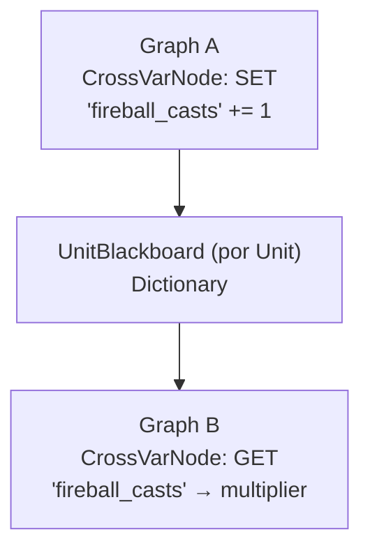

# Plano 3: Variáveis Cross-Habilidade (Graph ↔ Graph)

## Visão Geral
Permitir que uma habilidade (Graph A) leia ou modifique variáveis de outra habilidade (Graph B) da mesma unidade. Isso possibilita sinergias como:
- "Cada uso de Fireball aumenta o dano de Firestorm em 5"
- "O escudo de gelo reduz o custo de mana de Ice Spike"

## Problema
Atualmente, cada `AbilityGraphSO` possui seu próprio Blackboard (`Variables`). Não existe comunicação entre grafos.

## Solução: Unit-Scoped Variables + CrossVariableNode

### Arquitetura



Cada `Unit` ganha um dicionário de variáveis persistentes durante o combate. Grafos lêem/escrevem nele via um nó especial.

---

## Proposed Changes

### Componente 1: Unit Blackboard

#### [MODIFY] [Unit.cs](file:///d:/Arquivos/Documentos/GitHub/Bichinhos-Magicos/Assets/Celestial-Cross/Scripts/Unit/Base/Unit.cs)
```csharp
[Header("Unit Blackboard (Cross-Ability)")]
public Dictionary<string, float> UnitBlackboard = new();
```

#### [MODIFY] [CombatContext](file:///d:/Arquivos/Documentos/GitHub/Bichinhos-Magicos/Assets/Celestial-Cross/Scripts/Combat/CombatHook.cs)
Propagar referência ao `UnitBlackboard` do caster no CombatContext quando o Interpreter inicializa.

---

### Componente 2: CrossVariableNode (Editor)

#### [NEW] [CrossVariableNode.cs](file:///d:/Arquivos/Documentos/GitHub/Bichinhos-Magicos/Assets/Celestial-Cross/Scripts/Abilities/Graph/Editor/Nodes/CrossVariableNode.cs)
Nó de editor com:
- **Dropdown de Operação**: `Get`, `Set`, `Add`, `Multiply`
- **Campo**: `unitVariableName` (nome da variável no UnitBlackboard, ex: `"fireball_casts"`)
- **Campo**: `localVariableName` (nome da variável local do grafo onde será lido/escrito)
- **Campo**: `value` (usado como fallback ou valor de Set)

UI:
```
┌─────────────────────────────┐
│  Cross Variable Node        │
│ ──────────────────────────  │
│ Operation: [Add    ▼]       │
│ Unit Var:  fireball_casts   │
│ Local Var: dmg_multiplier   │
│ Value:     1.0              │
│ ──────────────────────────  │
│ [In]                  [Out] │
└─────────────────────────────┘
```

---

### Componente 3: Runtime Data + Interpreter

#### [NEW] [CrossVariableNodeData](file:///d:/Arquivos/Documentos/GitHub/Bichinhos-Magicos/Assets/Celestial-Cross/Scripts/Abilities/Graph/Runtime/AbilityNodeRuntimeData.cs)
```csharp
[Serializable]
public class CrossVariableNodeData
{
    public enum CrossVarOp { Get, Set, Add, Multiply }
    public CrossVarOp operation = CrossVarOp.Get;
    public string unitVariableName;    // Chave no UnitBlackboard
    public string localVariableName;   // Chave no context.Variables (blackboard do grafo)
    public float value;                // Valor para Set/Add/Multiply, ou default para Get
}
```

#### [MODIFY] [AbilityGraphInterpreter.cs](file:///d:/Arquivos/Documentos/GitHub/Bichinhos-Magicos/Assets/Celestial-Cross/Scripts/Abilities/Graph/Runtime/AbilityGraphInterpreter.cs)
Adicionar case no switch:
```csharp
case "CrossVariableNode":
    var crossData = JsonUtility.FromJson<CrossVariableNodeData>(node.JsonData);
    ExecuteCrossVariable(crossData, context);
    break;
```

Método:
```csharp
private void ExecuteCrossVariable(CrossVariableNodeData data, CombatContext context)
{
    var board = context.source?.UnitBlackboard;
    if (board == null) return;
    
    switch (data.operation)
    {
        case CrossVariableNodeData.CrossVarOp.Get:
            float val = board.ContainsKey(data.unitVariableName) 
                ? board[data.unitVariableName] : data.value;
            context.Variables[data.localVariableName] = val;
            break;
        case CrossVariableNodeData.CrossVarOp.Set:
            board[data.unitVariableName] = data.value;
            break;
        case CrossVariableNodeData.CrossVarOp.Add:
            if (!board.ContainsKey(data.unitVariableName))
                board[data.unitVariableName] = 0;
            board[data.unitVariableName] += data.value;
            break;
        case CrossVariableNodeData.CrossVarOp.Multiply:
            if (board.ContainsKey(data.unitVariableName))
                board[data.unitVariableName] *= data.value;
            break;
    }
}
```

---

### Componente 4: Search Window

#### [MODIFY] [AbilityNodeSearchWindow.cs](file:///d:/Arquivos/Documentos/GitHub/Bichinhos-Magicos/Assets/Celestial-Cross/Scripts/Abilities/Graph/Editor/AbilityNodeSearchWindow.cs)
Adicionar entrada "Cross Variable" na categoria "Logic & Flow".

---

## Verificação
- [ ] Criar Graph A com CrossVarNode operation=Add, unitVar="counter", value=1
- [ ] Criar Graph B com CrossVarNode operation=Get, unitVar="counter", localVar="mult"
- [ ] Executar A 3 vezes, depois B → variável `mult` deve valer 3
- [ ] Verificar que Board reseta entre combates
