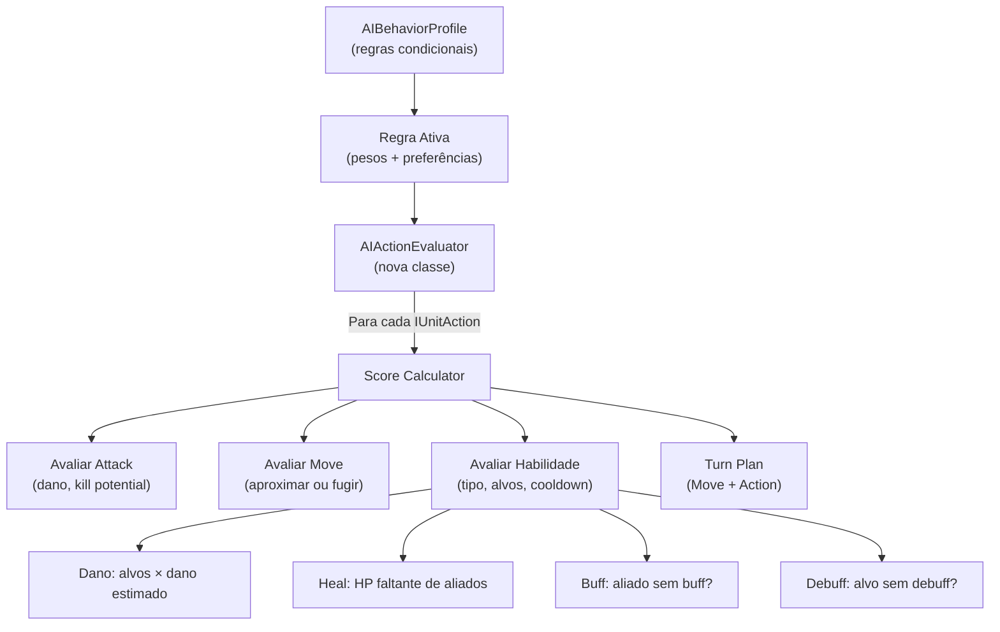

# Plano 5: Redesign do Sistema de IA

## Diagnóstico do Sistema Atual

### O que funciona
- **BehaviorProfile** (SO) com regras condicionais (HP%, aliados vivos, último inimigo) — bom sistema, manter
- **BossPhases** (AIPatternData) com troca de perfil por HP threshold — bom, manter
- **Target Preference** (closest, lowest HP, role, class) — bom, manter e expandir

### O que está quebrado/faltando
| Problema | Impacto |
|----------|---------|
| `AIBrain.EvaluateAllActions()` só avalia `AttackAction` e `MoveAction` | **Habilidades são completamente ignoradas** — a IA nunca usa skills, graphs, heals, buffs |
| `abilityWeight` existe na Rule mas nunca é usado | Campo morto |
| Não há conceito de "sequência de turno" (mover → usar skill) | IA ataca OU move, nunca combina |
| Sem cooldown tracking | IA usaria a mesma skill todo turno |
| Sem awareness de buffs/debuffs ativos | IA não sabe se já tem buff, não sabe se alvo tem debuff |

---

## Abordagem Recomendada: **Utility AI via Inspector** (não Graphs)

> [!IMPORTANT]
> **Por que NÃO um Graph para IA?**
> Graphs são excelentes para definir *o que uma habilidade faz* (sequência linear de efeitos). Mas IA é sobre *decisões paralelas com scoring* — avaliar N opções simultaneamente e escolher a melhor. Um graph hierárquico (Behavior Tree) seria visualmente atraente mas significativamente mais complexo de implementar e **menos flexível** para balanceamento rápido via Inspector.
>
> A abordagem **Utility AI via ScriptableObjects** é a melhor para seu caso porque:
> 1. **Inspector-friendly**: designers ajustam pesos sem código
> 2. **Paralela**: avalia todas as ações e alvos simultaneamente
> 3. **Já existe parcialmente**: seu `AIBehaviorProfile` + `AIBehaviorRule` são a base
> 4. **Debugging visual**: scores são números fáceis de logar e debugar

---

## Arquitetura Nova



---

## Proposed Changes

### Componente 1: AIAbilityHint — Metadata por Habilidade

O conceito-chave: a IA não precisa "entender" o grafo inteiro. Só precisa de **hints** (dicas) sobre o que cada habilidade faz.

#### [NEW] [AIAbilityHint.cs](file:///d:/Arquivos/Documentos/GitHub/Bichinhos-Magicos/Assets/Celestial-Cross/Scripts/Unit/Enemy/AI/AIAbilityHint.cs)
```csharp
[Serializable]
public class AIAbilityHint
{
    public enum AbilityCategory { Damage, Heal, Buff, Debuff, Summon, Utility }
    
    public AbilityCategory category = AbilityCategory.Damage;
    
    [Tooltip("Prioridade base desta habilidade (0-100). Skills mais fortes = maior.")]
    [Range(0, 100)] public int basePriority = 50;
    
    [Tooltip("Cooldown em turnos após uso. 0 = sem cooldown.")]
    public int cooldownTurns = 0;
    
    [Tooltip("Score bônus quando o alvo tem HP < 30%.")]
    public float lowHPTargetBonus = 0;
    
    [Tooltip("Score bônus quando NÃO existe este buff/debuff no alvo.")]
    public float freshApplicationBonus = 20;
    
    [Tooltip("Se true, a IA mira em aliados (self/allies) em vez de inimigos.")]
    public bool targetsFriendlies = false;
    
    [Tooltip("Estimativa de valor numérico (dano/heal/buff strength) para scoring.")]
    public float estimatedValue = 10;
}
```

#### [MODIFY] [AbilityGraphSO.cs](file:///d:/Arquivos/Documentos/GitHub/Bichinhos-Magicos/Assets/Celestial-Cross/Scripts/Abilities/Graph/AbilityGraphSO.cs)
```csharp
[Header("AI Hints")]
public AIAbilityHint aiHint;
```

#### [MODIFY] [AbilityBlueprint.cs](file:///d:/Arquivos/Documentos/GitHub/Bichinhos-Magicos/Assets/Celestial-Cross/Scripts/Abilities/AbilityBlueprint.cs)
```csharp
[Header("AI Hints")]
public AIAbilityHint aiHint;
```

---

### Componente 2: Cooldown Tracking

#### [NEW] [AICooldownTracker.cs](file:///d:/Arquivos/Documentos/GitHub/Bichinhos-Magicos/Assets/Celestial-Cross/Scripts/Unit/Enemy/AI/AICooldownTracker.cs)
```csharp
public class AICooldownTracker
{
    private Dictionary<string, int> cooldowns = new(); // actionID → turnos restantes
    
    public void UseAbility(string actionID, int cooldownTurns) { ... }
    public bool IsOnCooldown(string actionID) { ... }
    public void TickCooldowns() { ... } // chamado no OnTurnEnd
}
```

---

### Componente 3: Reescrever `AIBrain.EvaluateAllActions`

#### [MODIFY] [AIBrain.cs](file:///d:/Arquivos/Documentos/GitHub/Bichinhos-Magicos/Assets/Celestial-Cross/Scripts/Unit/Enemy/AI/AIBrain.cs)

**Mudança principal**: Iterar sobre `unit.Actions` (que inclui `BlueprintActionWrapper` e `GraphActionWrapper`) em vez de `GetComponents<UnitActionBase>()`.

```csharp
List<AIActionScore> EvaluateAllActions(...)
{
    List<AIActionScore> scores = new();
    
    for (int i = 0; i < enemy.Actions.Count; i++)
    {
        var action = enemy.Actions[i];
        
        // Pular ações passivas ou em cooldown
        if (action is GraphActionWrapper gw && !gw.Graph.IsActive) continue;
        if (cooldownTracker.IsOnCooldown(action.ActionName)) continue;
        
        // Extrair hint
        AIAbilityHint hint = GetHintForAction(action);
        
        if (action is UnitActionBase baseAction)
        {
            if (baseAction is AttackAction atk)
                scores.AddRange(EvaluateAttack(...));
            else if (baseAction is MoveAction move)
                scores.AddRange(EvaluateMove(...));
        }
        else // Blueprint ou Graph wrapper
        {
            scores.AddRange(EvaluateAbility(i, action, hint, ...));
        }
    }
    return scores;
}
```

---

### Componente 4: Ability Scoring

#### Novo método `EvaluateAbility` no `AIBrain`:

```csharp
List<AIActionScore> EvaluateAbility(int actionIndex, IUnitAction action, 
    AIAbilityHint hint, List<Unit> playerUnits, List<Unit> allyUnits, 
    BehaviorType behavior, float weight, float randomness)
{
    List<AIActionScore> scores = new();
    if (hint == null) return scores;
    
    List<Unit> potentialTargets = hint.targetsFriendlies ? allyUnits : playerUnits;
    
    foreach (var target in potentialTargets)
    {
        float score = hint.basePriority;
        
        switch (hint.category)
        {
            case Damage:
                score += hint.estimatedValue * 0.5f;
                // Bônus kill potential
                if (target.Health.CurrentHealth <= hint.estimatedValue) score += 50;
                // Bônus low HP
                float targetHpPct = target.Health.CurrentHealth / (float)target.MaxHealth;
                if (targetHpPct < 0.3f) score += hint.lowHPTargetBonus;
                break;
                
            case Heal:
                float missingHP = target.MaxHealth - target.Health.CurrentHealth;
                score += missingHP * 0.3f; // Mais heal necessário = maior score
                if (missingHP <= 0) score = -100; // Não curar quem está full
                break;
                
            case Buff:
                score += hint.freshApplicationBonus; // TODO: check if already buffed
                break;
                
            case Debuff:
                score += hint.freshApplicationBonus; // TODO: check if already debuffed
                break;
        }
        
        // Multiplicar pelo peso da regra ativa
        score = ApplyWeightAndRandomness(score, weight * hint.basePriority / 50f, randomness);
        
        scores.Add(new AIActionScore { actionIndex = actionIndex, target = target, score = score });
    }
    return scores;
}
```

---

### Componente 5: Turn Plan (Move + Action)

#### Novo conceito: `AITurnPlan`

Em vez de executar apenas UMA ação, a IA planeja um turno com até 2 passos:
1. **Move** (opcional) — se aproximar/afastar
2. **Action** — atacar ou usar habilidade

```csharp
[Serializable]
public struct AITurnPlan
{
    public AIActionScore moveStep;    // Pode ser null
    public AIActionScore actionStep;  // A ação principal
    public float combinedScore;
    public bool hasMove;
}
```

O `ExecuteTurn` passa a:
1. Avaliar todas as ações para a posição atual
2. Para cada tile alcançável por movimento, avaliar todas as ações daquela posição
3. Combinar move + action no melhor `AITurnPlan`
4. Executar move (se houver), aguardar, depois executar action

---

### Componente 6: Execução de Habilidades

#### [MODIFY] [AIBrain.cs](file:///d:/Arquivos/Documentos/GitHub/Bichinhos-Magicos/Assets/Celestial-Cross/Scripts/Unit/Enemy/AI/AIBrain.cs)

Adicionar `ExecuteAbilityDirect`:
```csharp
void ExecuteAbilityDirect(IUnitAction action, Unit target)
{
    if (action is GraphActionWrapper gw)
    {
        // Definir o alvo no contexto e executar o grafo
        AbilityExecutor.Instance.ExecuteGraph(
            enemy, gw.Graph, CombatHook.OnManualCast, 
            () => TurnManager.Instance.EndTurn(), gw.Level
        );
    }
    else if (action is BlueprintActionWrapper bw)
    {
        AbilityExecutor.Instance.ExecuteAbility(
            enemy, bw.Blueprint, CombatHook.OnManualCast,
            () => TurnManager.Instance.EndTurn()
        );
    }
}
```

---

### Componente 7: Inspector Melhorado

#### [MODIFY] [AIBehaviorRule.cs](file:///d:/Arquivos/Documentos/GitHub/Bichinhos-Magicos/Assets/Celestial-Cross/Scripts/Unit/Enemy/AI/AIBehaviorRule.cs)
Adicionar:
```csharp
[Header("Ability Weights")]
[Tooltip("Multiplicador para habilidades de dano")]
[Range(0, 3)] public float damageAbilityWeight = 1f;
[Tooltip("Multiplicador para curas")]
[Range(0, 3)] public float healAbilityWeight = 1f;
[Tooltip("Multiplicador para buffs")]
[Range(0, 3)] public float buffAbilityWeight = 1f;
[Tooltip("Multiplicador para debuffs")]
[Range(0, 3)] public float debuffAbilityWeight = 1f;
```

Isso permite regras como:
- "Quando HP < 30%: healWeight = 3, damageWeight = 0.5" → IA foca em curar
- "Quando está sozinho: damageWeight = 2, buffWeight = 0" → all-in

---

## Resumo Visual: Configuração de um Inimigo

```
EnemyUnit (Inspector)
├── UnitData (SO) 
│   ├── abilities: [Fireball, Heal, Shield]
│   └── abilityGraphs: [BurnGraph, BuffGraph]
│
├── AIBehaviorProfile (SO) — "Mago Agressivo"
│   ├── Rule 1: "Modo Normal" (HP > 50%)
│   │   ├── behavior: Aggressive
│   │   ├── targetPref: LowestHealth
│   │   ├── damageAbilityWeight: 1.5
│   │   └── healAbilityWeight: 0.3
│   │
│   ├── Rule 2: "Desespero" (HP < 30%)
│   │   ├── behavior: Defensive
│   │   ├── healAbilityWeight: 3.0
│   │   └── moveWeight: 2.0 (fugir)
│   │
│   └── fallback: Balanced
│
├── AIPatternData (SO) — Boss
│   └── Phase: "Fúria" (HP < 50%)
│       └── newProfile: "Mago Furioso"
│
└── Cada Habilidade tem um AIAbilityHint
    ├── Fireball: {category: Damage, priority: 60, cooldown: 0}
    ├── Heal: {category: Heal, priority: 40, cooldown: 2, targetsFriendlies: true}
    └── Shield: {category: Buff, priority: 30, cooldown: 3, targetsFriendlies: true}
```

---

## Ordem de Implementação Sugerida
1. `AIAbilityHint` (data class) + adicionar nos SOs
2. `AICooldownTracker`
3. Reescrever `EvaluateAllActions` para iterar `unit.Actions`
4. `EvaluateAbility` method
5. `AITurnPlan` (move + action combo)
6. `ExecuteAbilityDirect` (execução de graphs/blueprints)
7. Atualizar `AIBehaviorRule` com pesos por categoria
8. Testar com inimigo que tem 2+ habilidades

## Verificação
- [ ] Inimigo com Fireball + Heal: usa Heal quando HP < 30%
- [ ] Cooldown: após usar skill, não usa de novo por N turnos
- [ ] Turn Plan: inimigo se move E ataca no mesmo turno
- [ ] Boss muda de perfil ao atingir threshold de HP
- [ ] IA ignora habilidades passivas e condições
