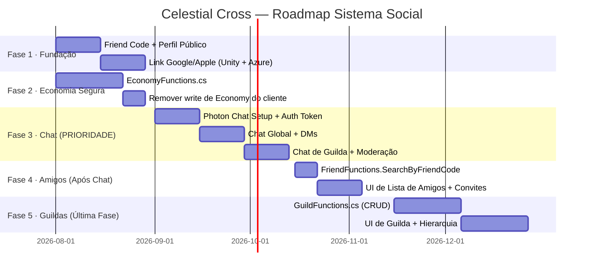

# Plano: Sistema de Conta Online Robusto — Celestial Cross

> **Versão:** 3.0 (Decisões de Design Confirmadas)  
> **Objetivo:** Elevar o sistema de conta ao nível de Genshin Impact / Summoners War / AFK Journey  
> — identidade real, economia segura, amigos, guildas e chat em tempo real.

## ✅ Decisões de Design Confirmadas

| # | Questão | Decisão |
|---|---|---|
| 1 | Limite de amigos | **100 por jogador** |
| 2 | Modelo de amizade | **Mútua** — convite + aceite, como em Summoners War |
| 3 | Tamanho de guilda | **50 membros** |
| 4 | Guest em guilda | **Não permitido** — requer conta vinculada |
| 5 | Canais de chat | **Multi-canal sem limitação regional** (custo será monitorado) |
| 6 | Mensagens diretas (DM) | **Sim** |
| 7 | Friend Code renovável | **Não** — o código é imutável |
| 8 | Voice chat | **Nunca** — Photon Chat (texto puro) |

> **Ordem de implementação redefinida:** Chat vem **antes** de Amigos e Guildas. Amigos e Guildas são a última fase.

---

## Diagnóstico Atual

| Aspecto | Situação Atual | Problema Real |
|---|---|---|
| **Identidade** | `LoginWithCustomID` (Device ID) | Conta perdida ao trocar de celular; sem portabilidade |
| **Save na nuvem** | JSON gigante em `UserData` (legacy) | Client envia o que quiser; sem controle de versão |
| **Economia** | `StarMaps`, `Money` no JSON do cliente | Jogador pode editar antes de enviar (trapaça) |
| **Social** | Inexistente | Zero infra para amigos, guildas, chat |
| **Identidade pública** | `PlayerName` sem unicidade | Impossível de adicionar como amigo |
| **Gacha & Energia** | ✅ Azure Functions server-authoritative | Correto! É o padrão a seguir nos novos sistemas |

> [!NOTE]
> **Boa notícia:** `GachaFunctions.cs` e `EnergyFunctions.cs` já implementam o padrão correto da indústria — o servidor lê, valida e salva. Os novos sistemas seguirão exatamente este padrão.

---

## Arquitetura Final do Sistema

```
[Unity Client (Android / iOS)]
        │
        ├─► PlayFab Client SDK
        │       ├── LoginWithAndroidDeviceID / LoginWithAppleIdentityToken
        │       ├── LinkGoogleAccount / LinkAppleAccount
        │       └── GetFriendsList / AddFriend
        │
        ├─► Azure Functions (CloudScript host)        ← fonte de verdade
        │       ├── AccountFunctions.cs    (identidade, Friend Code)
        │       ├── GachaFunctions.cs      ✅ já existe
        │       ├── EnergyFunctions.cs     ✅ já existe
        │       ├── EconomyFunctions.cs    (moedas seguras)
        │       ├── FriendFunctions.cs     (busca por Friend Code)
        │       ├── GuildFunctions.cs      (CRUD de guilda)
        │       ├── ChatAuthFunctions.cs   (negociação de token de chat)
        │       └── ModerationFunctions.cs (denúncias, mutes)
        │
        └─► Photon Chat SDK          ← chat em tempo real
                ├── Canal: global
                ├── Canal: guild_<GroupId>
                └── Canal: dm_<hash(PlayFabId+PlayFabId)>
```

---

## FASE 1 — Identidade Real e Friend Code

### 1.1 · Modelo "Guest → Conta Real" (Padrão da Indústria)

> [!IMPORTANT]
> **Regra de ouro:** Nunca bloquear o jogador com login antes de ele jogar. Cada tela de login extra representa 20-40% de drop-off no funil. O jogador começa como Guest e é incentivado a vincular depois.

**Fluxo em 3 fases:**

```
Fase 1 — Primeiro Acesso (sem fricção)
  └─► LoginWithAndroidDeviceID / LoginWithIOSDeviceID
        CreateAccount = true
        └─ Flag interna: profile.isGuest = true

Fase 2 — Milestone de Retenção (ex: após tutorial ou nível 5)
  └─► Pop-up: "Salve seu progresso! Vincule sua conta Google para jogar em qualquer dispositivo."

Fase 3 — Vínculo de Conta Real
  └─► Opções:
        ├── Google Play Games (Android)  → LinkGooglePlayGamesServicesAccountRequest
        ├── Apple Game Center (iOS)      → LinkAppleRequest
        ├── E-mail + Senha               → AddUsernamePasswordRequest
        └── Google OAuth                 → LinkGoogleAccountRequest
```

**Ponto crítico — Conflito de Contas:**  
Se o Google já pertence a outra conta PlayFab, retorna `AccountAlreadyClaimed`.  
Nunca fazer merge automático. Exibir para o jogador: *"Esta conta Google já possui progresso. Deseja usar ela ou manter a conta atual?"*

### 1.2 · Friend Code (#XXXXXXX)

O código é gerado **uma vez no servidor** no momento da criação da conta e **nunca muda**. É separado do `PlayerName` (editável). Formato: 7 dígitos numéricos → `#1582947`.

**Por que numérico puro?** — Elimina ambiguidade entre `O/0`, `I/1/l`. Cobre 9 milhões de jogadores. Se precisar escalar, adiciona 1 dígito.

```
Fluxo de Geração (AccountFunctions.cs — CreateAccount):
  1. Gera código aleatório de 7 dígitos
  2. Verifica unicidade no índice (PlayFab Title Data: "FC_1234567" → PlayFabId)
  3. Repete até encontrar código livre (colisão extremamente rara)
  4. Salva no UserData do jogador com Permission = Public
  5. Salva no índice do título (Title Data) para busca reversa
```

```csharp
// Azure Function: GenerateFriendCode (chamado internamente ao criar conta)
string friendCode;
bool isUnique = false;
while (!isUnique)
{
    friendCode = new Random().Next(1000000, 9999999).ToString();
    var indexCheck = await serverApi.GetTitleDataAsync(new GetTitleDataRequest {
        Keys = new List<string> { $"FC_{friendCode}" }
    });
    isUnique = !indexCheck.Result.Data.ContainsKey($"FC_{friendCode}");
}
// Indexar: "FC_1234567" → PlayFabId (para busca reversa)
await serverApi.SetTitleDataAsync(new SetTitleDataRequest {
    Key = $"FC_{friendCode}", Value = playFabId
});
// Salvar no perfil do jogador (público)
await serverApi.UpdateUserDataAsync(new UpdateUserDataRequest {
    PlayFabId = playFabId,
    Data = new Dictionary<string, string> { { "FriendCode", friendCode } },
    Permission = UserDataPermission.Public
});
```

> [!WARNING]
> **Limite de escala do Title Data:** Funciona até ~100k jogadores. Acima disso, migrar o índice para **Azure Table Storage** (custo mínimo, busca por PK). A estrutura permanece a mesma: `friendCode (PartitionKey)` → `playFabId (Value)`.

### 1.3 · Perfil Público do Jogador

Separação clara entre o que é público e o que é privado:

| Dado | Visibilidade | Onde armazenar |
|---|---|---|
| `FriendCode` | 🌐 Público | `UserData["FriendCode"]` (Permission.Public) |
| `PlayerName` | 🌐 Público | `UserData["PublicProfile"]` (Permission.Public) |
| `Level`, `IconId`, `GuildTag` | 🌐 Público | `UserData["PublicProfile"]` |
| `Money`, `StarMaps`, `Stardust` | 🔒 Server Only | `UserInternalData["Economy"]` |
| `OwnedUnits`, `OwnedPets` | 🔒 Privado | `UserData["Inventory"]` (Permission.Private) |
| `GachaPityStates`, `EnergyData` | 🔒 Privado | `UserData["GameplayData"]` |
| `Settings` (volume, idioma) | 🔒 Privado | `UserData["Settings"]` |

**`PublicProfile` (JSON):**
```json
{
  "PlayerName": "Viajante das Estrelas",
  "IconId": "icon_celestial_03",
  "Level": 42,
  "FriendCode": "1582947",
  "GuildTag": "CC",
  "GuildName": "Celestial Cross",
  "LastOnlineUTC": "2026-07-27T02:00:00Z"
}
```

---

## FASE 2 — Estrutura de Dados (Entity API vs Legacy)

### Status dos Sistemas Atuais

| Sistema | API Atual | Recomendação |
|---|---|---|
| Gacha | Legacy UserData (`"AccountData"`) | ✅ Manter. Está correto e funcionando |
| Energia | Legacy UserData (`"EnergyData"`) | ✅ Manter. |
| Economia (moedas) | No JSON do client | 🔴 Migrar para server-only ASAP |
| Social (amigos, guilda) | Inexistente | ✅ Usar Entity API (Groups, Entities) |
| Perfil Público | Inexistente | ✅ Usar UserData Public |

> [!NOTE]
> **Não reescrever o que já funciona.** O custo de migrar Gacha e Energia para Entity API não justifica o benefício agora. O foco deve ser blindar a Economia e construir o Social do zero com a API correta.

---

## FASE 3 — Economia Server-Authoritative (Urgente)

### O Problema Crítico

Atualmente `StarMaps` e `Money` estão no JSON que o cliente pode editar. O Gacha já valida no servidor ✅ — mas nada impede um jogador de enviar um JSON adulterado direto para o PlayFab via `UpdateUserData`.

### A Solução: Remover Permissão de Escrita do Cliente

```csharp
// Azure Function: A única forma de mudar saldo é via servidor
// O client NUNCA chama UpdateUserData para economia

// ✅ Padrão correto: servidor lê → valida → modifica → salva
[Function("SpendCurrency")]
public async Task<HttpResponseData> SpendCurrency(...)
{
    // 1. Ler saldo ATUAL do servidor (não confiar no que o client enviou)
    var economyData = await ReadEconomyFromServer(playFabId);
    
    // 2. Validar se pode pagar
    if (economyData.StarMaps < cost)
        return InsufficientFunds();
    
    // 3. Aplicar transação atomicamente
    economyData.StarMaps -= cost;
    
    // 4. Salvar de volta
    await SaveEconomyToServer(playFabId, economyData);
    
    // 5. Retornar NOVO ESTADO — cliente atualiza UI com o que o servidor retornou
    return Ok(economyData);
}
```

**Funções a criar em `EconomyFunctions.cs`:**

```
AddCurrency(playFabId, type, amount, reason)    ← só server pode chamar
SpendCurrency(playFabId, type, amount, reason)  ← valida e debita
GrantItem(playFabId, itemId, quantity, source)  ← adiciona ao inventário
GetPlayerEconomy(playFabId)                     ← leitura segura
ValidatePurchase(receipt, signature, itemId)    ← IAP server-side
```

---

> [!IMPORTANT]
> **Amigos e Guildas foram movidos para DEPOIS do Chat** conforme prioridade definida. As fases 4 e 5 abaixo são implementadas após o chat estar estável.

## FASE 4 — Sistema de Amigos

### 4.1 · PlayFab Friends API (Nativa)

O PlayFab já tem um sistema de amigos pronto. Apenas precisamos integrá-lo com o Friend Code.

```csharp
// Cliente Unity — após o servidor retornar o PlayFabId do alvo
PlayFabClientAPI.AddFriend(new AddFriendRequest {
    FriendPlayFabId = targetPlayFabId
}, OnFriendAdded, OnFriendError);

// Listar amigos
PlayFabClientAPI.GetFriendsList(new GetFriendsListRequest {
    IncludeSteamFriends = false,
    IncludeFacebookFriends = false,
    ProfileConstraints = new PlayerProfileViewConstraints {
        ShowDisplayName = true,
        ShowStatistics = true
    }
}, OnFriendsListReceived, OnError);
```

### 4.2 · Busca por Friend Code (Azure Function)

```
Client → Digita "#1582947" → Envia para FriendFunctions.SearchByFriendCode
    ↓
Azure Function (FriendFunctions.cs):
  1. Strip o "#", busca no índice "FC_1582947" no Title Data
  2. Obtém PlayFabId do alvo
  3. Lê PublicProfile do alvo (UserData público)
  4. Retorna { PlayFabId, PlayerName, Level, IconId, GuildName } para o cliente

Client → Exibe card de perfil do alvo
    ↓
Client → Clica em "Adicionar Amigo" → PlayFabClientAPI.AddFriend(targetPlayFabId)
```

> [!NOTE]
> **Amizade é mútua:** um jogador manda convite, o outro aceita. O servidor deve fazer `AddFriend` nos dois lados somente após o aceite. Enquanto o convite estiver pendente, ele fica registrado como `PendingFriendRequest` no `UserData` de ambos.

---

## FASE 5 — Sistema de Guildas

### 5.1 · PlayFab Groups API

Os Groups do PlayFab são **Entidades de primeira classe** — possuem perfil próprio, JSON Objects e hierarquia de roles.

```
PlayFab Group (Guilda):
  ├── GroupId: "ABCD1234" (ID interno)
  ├── GroupName: "Estrelas Celestiais"
  ├── Roles:
  │     ├── "owner"    → Líder (1 por guilda)
  │     ├── "officer"  → Oficial (manage convites)
  │     └── "members"  → Membro
  └── Entity Objects:
        └── "GuildProfile": {
              Level, XP, Banner, Description,
              IsPublic, MinLevelToJoin, MaxMembers (50),
              WeeklyDonations, TotalWins
            }
```

**Ciclo de vida completo:**

| Operação | API PlayFab |
|---|---|
| Criar guilda | `CreateGroup` |
| Convidar jogador | `InviteToGroup` |
| Jogador pede para entrar | `ApplyToGroup` |
| Líder aceita pedido | `AcceptGroupApplication` |
| Promover membro | `ChangeMemberRole` |
| Expulsar membro | `RemoveGroupMembers` |
| Banir jogador | `BlockEntity` |
| Listar membros | `ListGroupMembers` |
| Atualizar dados da guilda | `UpdateGroup` + `SetObjects` |
| Dissolver guilda | `DeleteGroup` |

> [!WARNING]
> O PlayFab Groups API **não tem busca por nome de guilda** out-of-the-box. Para implementar "Buscar guilda por nome/tag", será necessário manter um índice manual no Title Data ou Azure Table Storage (`guild_name` → `groupId`).

### 5.2 · Dados por Membro na Guilda

Cada membro tem seu `role` gerenciado pela API. Dados extras do membro na guilda (doações semanais, último login) são armazenados como Entity Objects no próprio Group, indexados pelo PlayFabId.

> [!NOTE]
> **Guildas são a última fase de implementação.** Implementar apenas após o chat estar estável e o sistema de amigos operacional.

---

## FASE 6 — Chat em Tempo Real

### 6.1 · Tecnologia: Photon Chat

**Decisão confirmada: Photon Chat.** Voice chat descartado permanentemente.

| | **Photon Chat** ✅ |
|---|---|
| **Integração Unity** | SDK dedicado, direto ao ponto |
| **Canais** | Global, Guild, DM nativos |
| **Histórico** | Built-in (últimas N mensagens por canal) |
| **Voz** | ❌ Não (não necessário) |
| **Custo** | Por MAU (gratuito até 100 CCU) |
| **Setup** | ~1-2 dias |

### 6.2 · Canais de Chat

```
global              → Chat global único (sem separação regional)
guild_<GroupId>     → Chat privado da guilda
dm_<hash(A+B)>      → Mensagem direta entre dois jogadores
announce            → Apenas moderadores/admins escrevem (avisos)
```

> [!NOTE]
> Canal global único sem separação regional conforme decisão. O custo do Photon é por MAU, não por canal, então múltiplos canais por jogador não aumentam custo.

### 6.3 · Fluxo de Autenticação no Chat

```
1. Unity → Autentica no PlayFab → obtém PlayFabId
2. Unity → Azure Function ChatAuthFunctions.GetChatToken
     └─ Servidor valida PlayFabId + gera token temporário Photon (TTL: 1h)
3. Unity → Conecta ao Photon Chat com token
4. Unity → Entra nos canais (global + guilda)
5. Envio de mensagem → direto pelo Photon SDK (com limite de tamanho)
6. Mensagens de sistema (alertas, bans) → via Azure Function → Photon Admin API
```

> [!NOTE]
> O token de autenticação do Photon é gerado **pelo servidor** (Azure Function) com o `AppSecret` do Photon, que nunca vai para o cliente. O cliente só recebe o token temporário.

### 6.4 · Estrutura de Mensagem

```csharp
public class ChatMessage
{
    public string MessageId { get; set; }       // GUID único
    public string ChannelId { get; set; }       // "guild_ABCD1234"
    public string SenderPlayFabId { get; set; }
    public string SenderName { get; set; }
    public string SenderIconId { get; set; }
    public int SenderLevel { get; set; }
    public string Content { get; set; }         // Máx. 200 chars
    public string SentAtUTC { get; set; }       // ISO 8601
    public string MessageType { get; set; }     // "text" | "system" | "emote"
}
```

### 6.5 · Persistência do Histórico

| Canal | Retenção | Storage |
|---|---|---|
| Global | Últimos 30 min / 200 msgs | In-memory Photon (automático) |
| Guilda | Últimas 100 msgs / 7 dias | Azure Table Storage |
| DM | 30 dias | Azure Table Storage |
| Sistema/Anúncios | Permanente | Azure Table Storage |

---

## FASE 7 — Moderação e Segurança

### 7.1 · Rate Limiting

```csharp
// Em cada Azure Function crítica:
var callKey = $"ratelimit_{playFabId}_chat";
var lastCall = await cache.GetAsync(callKey);
if (lastCall != null && (DateTime.UtcNow - lastCall) < TimeSpan.FromSeconds(1))
    return TooManyRequests("Aguarde antes de enviar outra mensagem.");
await cache.SetAsync(callKey, DateTime.UtcNow, TTL: 10s);
```

Limites recomendados:
- **Chat:** máx. 5 mensagens / 5 segundos por jogador
- **Gacha:** máx. 10 pulls / segundo (já protegido ✅)
- **AddFriend:** máx. 30 por hora por jogador

### 7.2 · Filtro de Conteúdo

- Usar **Azure AI Content Moderator** (integração nativa no Azure) — filtra texto automaticamente em pt-BR e en.
- Nunca confiar no cliente para censurar.
- Palavras bloqueadas → mensagem recusada com erro amigável.

### 7.3 · Sistema de Denúncias

```
Azure Function: ReportPlayer(reporter, reported, reason, messageId)
  1. Salva denúncia no Azure Table Storage
  2. Se jogador atingir N denúncias em 24h → mute automático (1h)
  3. Se atingir M denúncias em 7 dias → flag para revisão manual
```

### 7.4 · Segurança de Conta

| Medida | Detalhes |
|---|---|
| Session token | PlayFab gera automaticamente (expira em 24h) |
| Economy escrita | `UserInternalData` apenas server-write |
| Secrets | `Environment.GetEnvironmentVariable()` — já correto ✅ |
| Rate limiting | Por PlayFabId em cada Azure Function crítica |
| Anomalia de gasto | Alert se saldo cresce X unidades/hora sem IAP |
| IAP Validation | `ValidateGooglePlayPurchase` / `ValidateAppleReceipt` no servidor |

---

## Roadmap de Implementação



---

## Comparativo Final: Antes vs. Depois

| Feature | Antes (Atual) | Depois (Plano) |
|---|---|---|
| **Identidade** | Device ID (perde ao trocar celular) | Google/Apple/E-mail + Guest seguro |
| **Recuperação de conta** | ❌ Impossível sem o dispositivo | ✅ Login com Google/Apple/Email |
| **Economia** | Client-controlled (vulnerável) | ✅ 100% server-authoritative |
| **Friend Code** | ❌ | ✅ `#1582947` (imutável, buscável) |
| **Lista de amigos** | ❌ | ✅ PlayFab Friends API (mútua, 100 max) |
| **Guildas** | ❌ | ✅ PlayFab Groups API (50 membros) |
| **Chat** | ❌ | ✅ Photon Chat (global, guilda, DM) |
| **Histórico chat** | ❌ | ✅ Azure Table Storage |
| **Moderação** | ❌ | ✅ Rate limit + filtro AI + denúncia |
| **Segurança de secrets** | ✅ Env vars (já correto) | ✅ Mantido |
| **IAP Validation** | ❌ | ✅ Apple/Google server-side |
