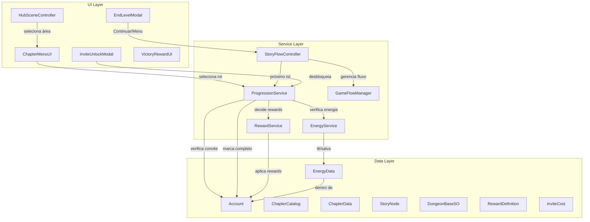

# Sistema de Progressão, Salvamento e Economia — Celestial Cross

Implementação de um sistema completo de progressão, energia, convites (chaves de diálogo), recompensas extensíveis e navegação entre áreas do jogo.

## Decisões de Design (Aprovadas na Entrevista)

| Decisão | Resultado |
|---|---|
| Energia máxima base | 100, regeneração 1/5min |
| Custo de energia | Configurável por fase/diálogo no Inspector |
| Anti-trapaça | Timestamp UTC servidor + fallback local + congelamento |
| Excesso de energia | Sem limite, regeneração só abaixo do cap |
| Convites | Itens no `OwnedItems` com IDs (`convite_leidell`, `convite_generico`) |
| UX de convite | Modal com opções de desbloqueio |
| Desbloqueio permanente | Sim, sem custo para repetir diálogos |
| Rewards | `RewardDefinition` com enum + híbrido com LootTable |
| Migração rewards | Substituir `RewardPackage` antigo |
| Progressão | `CompletedNodeIDs` com prefixos por tipo |
| Editor | Odin Inspector disponível |
| Diálogos | Deprecar Legacy, migrar para Graph. Unificar diários em `ChapterData`. |
| Hub | Menu de áreas → capítulos → nós |
| Fluxo pós-nó | Resultado + botões "Continuar"/"Menu" |
| Combates história | Energia + PreparationScene + unidades fixas |
| Ruínas | Dungeons sequenciais com `CompletedNodeIDs` |
| Repetição | First clear rewards + repeat rewards separados |
| Arquitetura | `ProgressionService` centralizado |
| Utilitários Editor | Criar ferramentas para atualizar UI e analisar cenas. |

---

## Proposed Changes

### Componente 1: Sistema de Recompensas Extensível

> Substituir o `RewardPackage` atual por um sistema baseado em `RewardDefinition` com suporte a LootTables.

#### [NEW] [RewardType.cs](file:///d:/Arquivos/Documentos/GitHub/Bichinhos-Magicos/Assets/Celestial-Cross/Scripts/Data/Rewards/RewardType.cs)
```csharp
public enum RewardType
{
    Money,
    Energy, 
    Stardust,
    StarMaps,
    XP,
    Unit,
    Pet,
    Artifact,
    Item,        // Inclui convites (convite_leidell, convite_generico, etc.)
    LootTable    // Referência a uma BaseLootTable para geração procedural
}
```

#### [NEW] [RewardDefinition.cs](file:///d:/Arquivos/Documentos/GitHub/Bichinhos-Magicos/Assets/Celestial-Cross/Scripts/Data/Rewards/RewardDefinition.cs)
```csharp
[Serializable]
public class RewardDefinition
{
    public RewardType Type;
    public int Amount;
    public string ReferenceID;           // ID do item, unidade, pet, etc.
    public UnitData UnitRef;             // Referência direta ao SO (para Unit)
    public PetSpeciesDataSO PetRef;      // Referência direta ao SO (para Pet)
    public ArtifactSetSO ArtifactRef;    // Referência direta ao SO (para Artifact)
    public BaseLootTable LootTableRef;   // Referência ao loot table (para LootTable)
}
```
- Usar `[ShowIf]` do Odin para mostrar apenas os campos relevantes ao `RewardType` selecionado
- O campo `ReferenceID` é usado para tipos como `Item` (onde o ID é uma string)

#### [NEW] [RewardPackageSO.cs](file:///d:/Arquivos/Documentos/GitHub/Bichinhos-Magicos/Assets/Celestial-Cross/Scripts/Data/Rewards/RewardPackageSO.cs)
- ScriptableObject com `List<RewardDefinition> Rewards`
- Substituirá o antigo `RewardPackage`
- Menu de criação: `Celestial Cross/Rewards/Reward Package`

#### [NEW] [RewardService.cs](file:///d:/Arquivos/Documentos/GitHub/Bichinhos-Magicos/Assets/Celestial-Cross/Scripts/System/RewardService.cs)
- Classe estática ou singleton que recebe uma `List<RewardDefinition>` e aplica ao `AccountManager`
- Processa cada tipo: soma moedas, adiciona itens, gera loot de LootTables, etc.
- Retorna um `RuntimeReward` (ou equivalente) para exibição na UI
- Substitui a lógica que hoje está em `AccountManager.ApplyRewards()`

#### [MODIFY] [RuntimeReward.cs](file:///d:/Arquivos/Documentos/GitHub/Bichinhos-Magicos/Assets/Celestial-Cross/Scripts/Data/Dungeon/RuntimeReward.cs)
- Adicionar campo `List<RewardDefinition> SourceDefinitions` para referência
- Manter campos existentes (`Money`, `Energy`, etc.) para compatibilidade com UI de vitória

#### [MODIFY] [LevelData.cs](file:///d:/Arquivos/Documentos/GitHub/Bichinhos-Magicos/Assets/Celestial-Cross/Scripts/Data/LevelData.cs)
- Substituir `RewardPackage VictoryRewards` por `List<RewardDefinition> FirstClearRewards` e `List<RewardDefinition> RepeatRewards`

#### [MODIFY] [PhaseManager.cs](file:///d:/Arquivos/Documentos/GitHub/Bichinhos-Magicos/Assets/Celestial-Cross/Scripts/System/PhaseManager.cs)
- `GrantRewards()` passará a usar `RewardService` e verificar se é first clear ou repeat via `CompletedNodeIDs`

#### [MODIFY] [AccountManager.cs](file:///d:/Arquivos/Documentos/GitHub/Bichinhos-Magicos/Assets/Celestial-Cross/Scripts/Account/AccountManager.cs)
- `ApplyRewards()` será simplificado/delegado ao `RewardService`

#### [DEPRECATE] [RewardPackage.cs](file:///d:/Arquivos/Documentos/GitHub/Bichinhos-Magicos/Assets/Celestial-Cross/Scripts/System/RewardPackage.cs)
- Marcar como `[Obsolete]`
- Manter temporariamente para não quebrar referências em assets existentes

---

### Componente 2: Sistema de Energia

> Sistema de regeneração de energia com proteção anti-trapaça baseada em timestamps UTC.

#### [NEW] [EnergyConfig.cs](file:///d:/Arquivos/Documentos/GitHub/Bichinhos-Magicos/Assets/Celestial-Cross/Scripts/Data/Energy/EnergyConfig.cs)
```csharp
[CreateAssetMenu(menuName = "Celestial Cross/Config/Energy Config")]
public class EnergyConfig : ScriptableObject
{
    public int MaxEnergy = 100;
    public float RegenIntervalSeconds = 300f; // 5 minutos
}
```

#### [NEW] [EnergyData.cs](file:///d:/Arquivos/Documentos/GitHub/Bichinhos-Magicos/Assets/Celestial-Cross/Scripts/Data/Energy/EnergyData.cs)
- Classe serializada salva na `Account`: `CurrentEnergy`, `LastRegenTimestampUTC` (string ISO 8601), `LastServerTimestampUTC`
- Substitui o campo `int Energy` atual da Account

#### [NEW] [EnergyService.cs](file:///d:/Arquivos/Documentos/GitHub/Bichinhos-Magicos/Assets/Celestial-Cross/Scripts/System/EnergyService.cs)
- Singleton MonoBehaviour, DontDestroyOnLoad
- **Regeneração offline**: Ao inicializar, calcula energia acumulada desde `LastRegenTimestamp` até agora
- **Regeneração em tempo real**: Coroutine que adiciona 1 energia a cada 5 minutos enquanto abaixo do cap
- **Anti-trapaça**: 
  - Obtém timestamp UTC do servidor (Unity Cloud) quando possível
  - Salva `LastServerTimestamp` na Account
  - Se `DateTime.UtcNow < LastServerTimestamp`, detecta manipulação → congela regeneração
  - Só descongela quando `DateTime.UtcNow >= LastServerTimestamp`
- **Excesso**: Permite energy > MaxEnergy. Regeneração pausa quando `CurrentEnergy >= MaxEnergy`
- **Eventos**: `OnEnergyChanged(int current, int max)`, `OnEnergyInsufficient(int required)`
- Métodos: `TryConsumeEnergy(int amount)`, `AddEnergy(int amount)`, `GetCurrentEnergy()`, `GetTimeUntilNextRegen()`

#### [MODIFY] [Account.cs](file:///d:/Arquivos/Documentos/GitHub/Bichinhos-Magicos/Assets/Celestial-Cross/Scripts/Account/Account.cs)
- Adicionar campo `EnergyData EnergyInfo`
- Manter campo `Energy` como property que delega para `EnergyInfo.CurrentEnergy` (compatibilidade)

#### [MODIFY] [AccountBootstrapConfig.cs](file:///d:/Arquivos/Documentos/GitHub/Bichinhos-Magicos/Assets/Celestial-Cross/Scripts/Account/AccountBootstrapConfig.cs)
- Substituir `StartingEnergy` por referência ao `EnergyConfig`

---

### Componente 3: ProgressionService

> Serviço centralizado que gerencia toda a lógica de progressão, desbloqueio e validação.

#### [NEW] [ProgressionService.cs](file:///d:/Arquivos/Documentos/GitHub/Bichinhos-Magicos/Assets/Celestial-Cross/Scripts/System/ProgressionService.cs)
- Singleton MonoBehaviour, DontDestroyOnLoad
- Responsabilidades:
  - `IsNodeCompleted(string nodeID)` → verifica em `CompletedNodeIDs`
  - `CompleteNode(string nodeID)` → adiciona a `CompletedNodeIDs`, salva, dispara evento
  - `IsChapterUnlocked(ChapterData chapter)` → verifica se o `RequiredChapter` foi completado
  - `IsRuinFloorUnlocked(DungeonBaseSO dungeon, int floorIndex)` → verifica se o andar anterior foi completado
  - `IsDiaryUnlocked(string diaryNodeID)` → verifica se está em CompletedNodeIDs ou foi desbloqueado por convite
  - `CanAffordEnergy(int cost)` → delega para `EnergyService`
  - `TryStartNode(StoryNode node)` → verifica energia + desbloqueio, consome energia se possível
  - `GetRewardsForNode(string nodeID, List<RewardDefinition> firstClear, List<RewardDefinition> repeat)` → retorna o reward adequado
- **Eventos**:
  - `OnNodeCompleted(string nodeID)`
  - `OnChapterCompleted(ChapterData chapter)`
  - `OnChapterUnlocked(ChapterData chapter)`
  - `OnProgressionError(string message)` (energia insuficiente, convite faltando, etc.)

#### [MODIFY] [ChapterMenuUI.cs](file:///d:/Arquivos/Documentos/GitHub/Bichinhos-Magicos/Assets/Celestial-Cross/Scripts/Game%20Flow/ChapterMenuUI.cs)
- Delegar verificações de lock/unlock para `ProgressionService`
- Remover lógica local de verificação de `CompletedNodeIDs`

#### [MODIFY] [EndLevelModal.cs](file:///d:/Arquivos/Documentos/GitHub/Bichinhos-Magicos/Assets/Celestial-Cross/Scripts/Game%20Flow/EndLevelModal.cs)
- Adicionar botão "Continuar" (carrega próximo nó) e "Menu" (volta ao Hub)
- Chamar `ProgressionService.CompleteNode()` ao vencer

---

### Componente 4: Sistema de Convites

> Convites como itens no `OwnedItems`, com sistema de custo variável e modal de desbloqueio.

#### [NEW] [InviteCost.cs](file:///d:/Arquivos/Documentos/GitHub/Bichinhos-Magicos/Assets/Celestial-Cross/Scripts/Data/Diary/InviteCost.cs)
```csharp
[Serializable]
public class InviteCost
{
    public string InviteItemID;  // ex: "convite_leidell" ou "convite_generico"
    public int Amount;
    public string DisplayName;   // ex: "1 Convite de Leidell" ou "20 Convites Genéricos"
}
```

#### [NEW] [DiaryNodeRequirement.cs](file:///d:/Arquivos/Documentos/GitHub/Bichinhos-Magicos/Assets/Celestial-Cross/Scripts/Data/Diary/DiaryNodeRequirement.cs)
```csharp
[Serializable]
public class DiaryNodeRequirement
{
    public bool RequiresInvite;
    public bool RequiresPreviousNode;
    public string PreviousNodeID;
    public List<InviteCost> InviteCostOptions; // Opções OR (1 Leidell OU 20 Genéricos)
}
```

#### [NEW] [InviteUnlockModal.cs](file:///d:/Arquivos/Documentos/GitHub/Bichinhos-Magicos/Assets/Celestial-Cross/Scripts/UI/Modals/InviteUnlockModal.cs)
- Modal que exibe opções de desbloqueio
- Para cada `InviteCost`, mostra um botão com nome + ícone
- Botões desabilitados se o jogador não tiver convites suficientes
- Ao clicar, consome os convites via `Account.RemoveItem()` e marca o nó como desbloqueado

#### [NEW] [InviteUnlockModalBuilder.cs](file:///d:/Arquivos/Documentos/GitHub/Bichinhos-Magicos/Assets/Celestial-Cross/Scripts/Editor/InviteUnlockModalBuilder.cs)
- UI Builder para gerar a hierarquia do modal no Editor

#### [MODIFY] [ChapterData.cs](file:///d:/Arquivos/Documentos/GitHub/Bichinhos-Magicos/Assets/Celestial-Cross/Scripts/Game%20Flow/ChapterData.cs)
- Para `IsDiaryChapter`: cada `StoryNode` terá um campo `DiaryNodeRequirement` para definir se precisa de convite

#### [MODIFY] [StoryNode.cs](file:///d:/Arquivos/Documentos/GitHub/Bichinhos-Magicos/Assets/Celestial-Cross/Scripts/Game%20Flow/StoryNode.cs)
- Adicionar campos:
  - `int EnergyCost` — custo de energia para executar
  - `List<RewardDefinition> FirstClearRewards` — rewards da primeira vez
  - `List<RewardDefinition> RepeatRewards` — rewards de repetição
  - `DiaryNodeRequirement Requirement` — requisitos de desbloqueio (convites, nó anterior)

---

### Componente 5: CombatStoryNode com Unidades Fixas

> Permitir que combates na história tenham unidades pré-definidas obrigatórias.

#### [NEW] [FixedUnitSlot.cs](file:///d:/Arquivos/Documentos/GitHub/Bichinhos-Magicos/Assets/Celestial-Cross/Scripts/Data/FixedUnitSlot.cs)
```csharp
[Serializable]
public class FixedUnitSlot
{
    public UnitData UnitRef;        // A unidade obrigatória
    public bool IsLocked;           // Não pode ser removida da equipe
    public bool UsePlayerBuild;     // Se true e o jogador tem a unidade, usa a build dele
    // Se false ou jogador não tem, usa build padrão (level 1, sem artefatos)
}
```

#### [MODIFY] [CombatStoryNode](file:///d:/Arquivos/Documentos/GitHub/Bichinhos-Magicos/Assets/Celestial-Cross/Scripts/Game%20Flow/StoryNode.cs)
- Adicionar `List<FixedUnitSlot> FixedSlots`
- Implementar `Execute()` para:
  1. Verificar energia via `ProgressionService.TryStartNode()`
  2. Configurar `GameFlowManager` com o `LevelData`
  3. Passar `FixedSlots` para a `PreparationScene`
  4. Carregar a `PreparationScene`

#### [MODIFY] [PlacementManager.cs](file:///d:/Arquivos/Documentos/GitHub/Bichinhos-Magicos/Assets/Celestial-Cross/Scripts/Game%20Flow/PlacementManager.cs) e/ou PreparationScene
- Ler `FixedSlots` do `GameFlowManager`
- Pré-colocar as unidades fixas (trancadas) na tela de seleção
- Permitir ao jogador preencher os slots restantes

---

### Componente 6: Navegação do Hub

> Reestruturar o Hub como menu de áreas → capítulos → nós, com fluxo automático entre nós.

#### [MODIFY] [HubSceneController.cs](file:///d:/Arquivos/Documentos/GitHub/Bichinhos-Magicos/Assets/Celestial-Cross/Scripts/Scenes/Hub/HubSceneController.cs)
- Substituir sistema de `HubCategory` por 4 áreas fixas:
  - **História** → abre lista de capítulos (`ChapterCatalog.mainStoryChapters`)
  - **Ruínas** → abre lista de masmorras (`DungeonCatalog`)
  - **Diário** → abre lista de diários (`ChapterCatalog.diaryChapters`)
  - **Missões Diárias** → placeholder (implementação futura)
- Ao selecionar um capítulo → abrir `ChapterMenuUI` com os nós
- Ao selecionar um nó → `ProgressionService.TryStartNode()` → executar
- Implementar navegação de volta (área ← capítulos ← nós)

#### [NEW] [StoryFlowController.cs](file:///d:/Arquivos/Documentos/GitHub/Bichinhos-Magicos/Assets/Celestial-Cross/Scripts/Game%20Flow/StoryFlowController.cs)
- Singleton DontDestroyOnLoad
- Gerencia o **fluxo automático** entre nós:
  - Ao completar um nó, verifica se há próximo nó no capítulo
  - Mostra resultado com botões "Continuar" e "Voltar ao Menu"
  - "Continuar" → carrega próximo nó automaticamente
  - "Voltar ao Menu" → retorna ao menu de capítulos da área atual
- Armazena contexto: capítulo atual, índice do nó atual, área de origem

#### [MODIFY] [GameFlowManager.cs](file:///d:/Arquivos/Documentos/GitHub/Bichinhos-Magicos/Assets/Celestial-Cross/Scripts/System/GameFlowManager.cs)
- Adicionar campos para contexto de story flow:
  - `ChapterData CurrentChapter`
  - `int CurrentNodeIndex`
  - `List<FixedUnitSlot> FixedSlots`
  - `string ReturnAreaID` (para saber para qual área voltar)

---

### Componente 7: Deprecação do Diálogo Legacy e Unificação de Diários

> Marcar scripts Legacy como obsoletos, migrar funcionalidades para o sistema Graph, e unificar o `DiaryCatalog` com o `ChapterCatalog`.

#### [MODIFY] Scripts em `Scripts/Dialogue/Legacy/`
- Adicionar `[Obsolete("Usar o sistema de DialogueGraph")]` em:
  - `DialogueSequence`
  - `DialogueManager` (Legacy)
  - `DialogueUI` (Legacy)
  - `DialogueEntry`, `DialogueChoice`

#### [MODIFY] [DialogueFlagManager.cs](file:///d:/Arquivos/Documentos/GitHub/Bichinhos-Magicos/Assets/Celestial-Cross/Scripts/Dialogue/Legacy/DialogueFlagManager.cs)
- Marcar como `[Obsolete]`
- As flags que eram salvas via `PlayerPrefs` devem ser migradas para variáveis do Blackboard do `DialogueGraph` ou para `CompletedNodeIDs`

#### [DEPRECATE/MIGRATE] [DiaryCatalog.cs](file:///d:/Arquivos/Documentos/GitHub/Bichinhos-Magicos/Assets/Celestial-Cross/Scripts/Dialogue/Graph/Editor/DiaryCatalog.cs)
- Os diários devem ser representados como `ChapterData` com a flag `IsDiaryChapter = true`
- Migrar conteúdo existente do `DiaryCatalog` para `ChapterCatalog.diaryChapters`

---

### Componente 8: Alterações na Account e Persistência

> Atualizar a classe Account para suportar os novos sistemas.

#### [MODIFY] [Account.cs](file:///d:/Arquivos/Documentos/GitHub/Bichinhos-Magicos/Assets/Celestial-Cross/Scripts/Account/Account.cs)
- Adicionar `EnergyData EnergyInfo` (substitui campo `Energy` simples)
- Adicionar `List<string> UnlockedDiaryNodeIDs` (nós desbloqueados por convite, separado dos completados)
- Manter `CompletedNodeIDs` para todos os tipos (com prefixos)
- Atualizar `EnsureInitialized()` para inicializar novos campos

#### [MODIFY] [AccountManager.cs](file:///d:/Arquivos/Documentos/GitHub/Bichinhos-Magicos/Assets/Celestial-Cross/Scripts/Account/AccountManager.cs)
- `ApplyRewards()` será refatorado para delegar ao `RewardService`
- Adicionar auto-save após mudanças de energia e convites

---

### Componente 9: Utilitários de UI e Cena (Editor)

> Criar utilitários para analisar cenas e atualizar UIs que foram afetadas pelas mudanças.

#### [NEW] [SceneUIUpdater.cs](file:///d:/Arquivos/Documentos/GitHub/Bichinhos-Magicos/Assets/Celestial-Cross/Scripts/Editor/SceneUIUpdater.cs)
- Editor script com MenuItem (ex: `Celestial Cross/Tools/Update Hub UI`, `Celestial Cross/Tools/Analyze Missing References`)
- Encontra referências quebradas de UIs antigas e permite a substituição por novos UIs via script
- Gera log detalhado das modificações em um painel do Editor

---

## Diagrama de Arquitetura



---

## Ordem de Implementação Recomendada

| Fase | Componente | Justificativa |
|---|---|---|
| 1 | **RewardDefinition + RewardService** | Base para todos os outros sistemas |
| 2 | **EnergySystem** | Necessário para validar entrada em fases |
| 3 | **Account + Persistência** | Integrar novos dados na Account |
| 4 | **ProgressionService** | Conecta tudo — depende de 1, 2 e 3 |
| 5 | **ConviteSystem** | Depende do ProgressionService |
| 6 | **CombatStoryNode + FixedSlots** | Depende do ProgressionService |
| 7 | **Hub Navigation + StoryFlowController** | Depende de todos os anteriores |
| 8 | **Deprecação Legacy + Unificação Diários** | Pode ser feita em paralelo com 7 |
| 9 | **Utilitários Editor** | Para facilitar a manutenção e atualização de Cenas/UI |

---

## Verification Plan

### Testes Automatizados
- Verificar que o projeto compila sem erros após cada fase
- Testar `EnergyService`: regeneração, anti-trapaça, excesso
- Testar `RewardService`: aplicação de cada tipo de reward
- Testar `ProgressionService`: desbloqueio sequencial, first clear vs repeat

### Verificação Manual
- Abrir o Hub e navegar entre áreas → capítulos → nós
- Completar um nó e verificar que o próximo desbloqueia
- Verificar que energia é consumida e regenera
- Verificar que convites funcionam para desbloquear diários
- Verificar que rewards são dados corretamente (first clear vs repeat)
- Fechar e reabrir o jogo para verificar persistência
- Testar manipulação de relógio para verificar anti-trapaça
