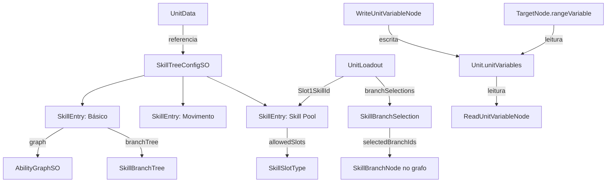
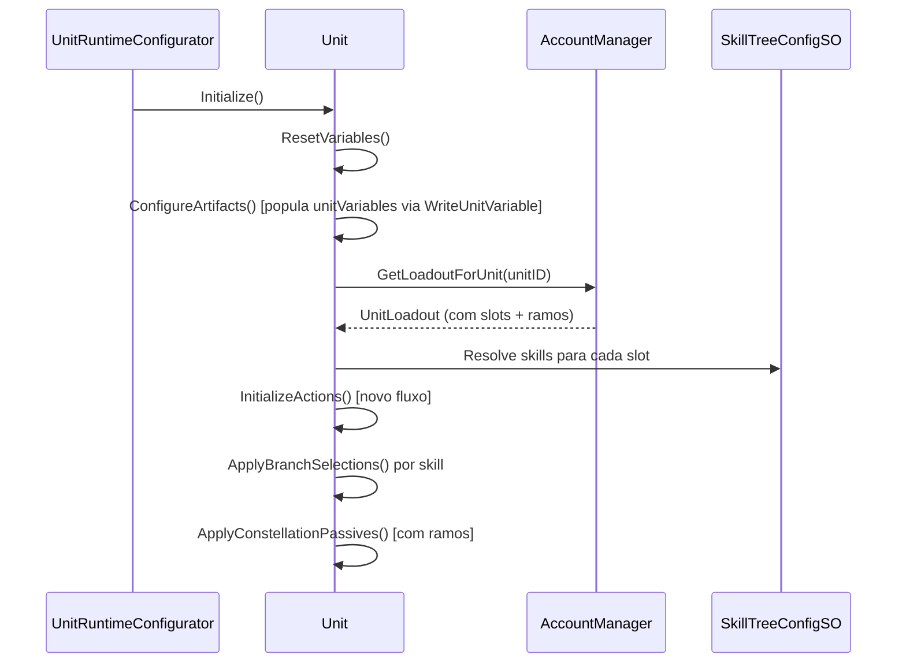

# Sistema de Árvore de Habilidades — Plano de Implementação

> **Versão:** 1.0  
> **Data:** 2026-05-23  
> **Status:** Aguardando aprovação  
> **Escopo:** Aliados (Player Units). Inimigos mantêm o sistema atual por enquanto.

---

## 1. Visão Geral

### 1.1 Resumo

Criar um sistema de **árvore de habilidades customizável** para unidades aliadas, onde o jogador pode:

1. Escolher quais habilidades equipar em **2 slots** (dentre as disponíveis para aquele personagem)
2. Personalizar **cada habilidade** (incluindo básico, movimentação e passivas) através de **ramos de modificação** cumulativos organizados em estágios
3. Utilizar **variáveis globais da unidade** (`UnitVariables`) que permitem que habilidades, artefatos e pets modifiquem o comportamento de outras habilidades

### 1.2 Estrutura de Ações por Unidade

| Slot | Tipo | Comportamento |
|---|---|---|
| **Ataque Básico** | Fixo (1 por personagem) | Sempre presente. Possui árvore de ramos. |
| **Movimentação** | Fixo (1 por personagem) | Sempre presente. Possui árvore de ramos. |
| **Slot 1** | Escolhível | Jogador seleciona dentre habilidades marcadas como compatíveis com Slot 1. Cada uma possui árvore de ramos. |
| **Slot 2** | Escolhível | Jogador seleciona dentre habilidades marcadas como compatíveis com Slot 2. Cada uma possui árvore de ramos. |
| **Passivas** | Automáticas | Constelação (existente) + artefatos + pets. Passivas de constelação também possuem árvore de ramos. |

### 1.3 Modelo de Ramos

A árvore de ramos é **hierárquica e cumulativa**:

```
Habilidade "Bola de Fogo"
│
├── Estágio 1
│   ├── Ramo A: +50% Dano
│   └── Ramo B: Adiciona AoE
│
├── Estágio 2 (se escolheu A no estágio 1)
│   ├── Ramo A1: Dano ignora defesa
│   └── Ramo A2: Aplica queimadura
│
├── Estágio 2 (se escolheu B no estágio 1)
│   ├── Ramo B1: Aumenta área
│   └── Ramo B2: Reduz cooldown
│
└── ... (estágios seguintes se expandem da mesma forma)
```

- **Cumulativo**: Os efeitos de todos os estágios escolhidos se aplicam simultaneamente
- **Desbloqueio**: Livre por enquanto (todos os estágios disponíveis). Sistema de desbloqueio será implementado futuramente
- **Flexível**: Quantidade de estágios e ramos por estágio é livre por habilidade

---

## 2. Arquitetura de Dados

### 2.1 Novos ScriptableObjects

#### 2.1.1 `SkillTreeConfigSO`

> **Caminho:** `Assets/Celestial-Cross/Scripts/Data/SkillTree/SkillTreeConfigSO.cs`

O SO central que define toda a árvore de habilidades de um personagem.

```csharp
[CreateAssetMenu(menuName = "Celestial Cross/Units/Skill Tree Config")]
public class SkillTreeConfigSO : ScriptableObject
{
    [Header("Habilidades Fixas")]
    public SkillEntry basicAttack;      // Ataque básico (sempre presente)
    public SkillEntry movement;         // Movimentação (sempre presente)
    
    [Header("Habilidades Selecionáveis")]
    public List<SkillEntry> availableSkills;  // Pool de habilidades para slots
}
```

#### 2.1.2 `SkillEntry`

> **Caminho:** `Assets/Celestial-Cross/Scripts/Data/SkillTree/SkillEntry.cs`

Define uma habilidade individual com seus ramos.

```csharp
[System.Serializable]
public class SkillEntry
{
    public string skillId;              // Identificador único
    public AbilityGraphSO graph;        // O grafo da habilidade
    
    [Tooltip("Em quais slots esta habilidade pode ser equipada")]
    public SkillSlotType[] allowedSlots; // Ex: [Slot1], [Slot1, Slot2], etc.
    
    [Tooltip("Árvore de ramos de modificação")]
    public SkillBranchTree branchTree;  // Estrutura hierárquica de ramos
}
```

#### 2.1.3 `SkillSlotType` (Enum)

```csharp
public enum SkillSlotType
{
    Basic,      // Ataque básico (fixo)
    Movement,   // Movimentação (fixa)
    Slot1,      // Slot selecionável 1
    Slot2       // Slot selecionável 2
}
```

#### 2.1.4 `SkillBranchTree`

Estrutura de árvore hierárquica para os ramos de cada habilidade.

```csharp
[System.Serializable]
public class SkillBranchTree
{
    public List<SkillBranchStage> stages; // Estágios ordenados (profundidade)
}

[System.Serializable]
public class SkillBranchStage
{
    public int stageIndex;                    // Índice do estágio (0, 1, 2...)
    public List<SkillBranchOption> options;   // Ramos disponíveis neste estágio
    
    [Tooltip("Qual ramo do estágio anterior é pré-requisito (vazio = qualquer)")]
    public string parentBranchId;             // ID do ramo pai (para sub-ramificação)
}

[System.Serializable]
public class SkillBranchOption
{
    public string branchId;        // ID único do ramo (ex: "A", "B", "A1", "A2")
    public string displayName;     // Nome para UI (ex: "Explosão Crítica")
    public string description;     // Descrição do efeito
    public Sprite icon;            // Ícone para UI
    
    [Tooltip("Sub-ramos que se abrem ao escolher este ramo")]
    public List<string> childBranchIds; // IDs dos ramos filhos no próximo estágio
}
```

### 2.2 Tags no AbilityGraphSO

> **Arquivo:** `Assets/Celestial-Cross/Scripts/Abilities/Graph/AbilityGraphSO.cs`

Adicionar campo de tags para categorização:

```csharp
// NOVO — Adicionar ao AbilityGraphSO
[Header("Tags & Classificação")]
[Tooltip("Tags para categorizar a habilidade (ex: 'ataque', 'slot1', 'movimentação', 'fogo')")]
public List<string> tags = new List<string>();
```

### 2.3 Integração com UnitData

> **Arquivo:** `Assets/Celestial-Cross/Scripts/Unit/Base/UnitData.cs`

```csharp
// NOVO — Adicionar ao UnitData
[Header("Skill Tree")]
[Tooltip("Configuração da árvore de habilidades deste personagem")]
public SkillTreeConfigSO skillTreeConfig;
```

O campo existente `abilityGraphs` será mantido por retrocompatibilidade (inimigos ainda usam), mas para aliados o `skillTreeConfig` terá prioridade.

### 2.4 Persistência — Expansão do UnitLoadout

> **Arquivo:** `Assets/Celestial-Cross/Scripts/Account/UnitLoadout.cs`

```csharp
// NOVOS CAMPOS no UnitLoadout
[Header("Skill Loadout")]
public string Slot1SkillId;     // ID da skill equipada no Slot 1
public string Slot2SkillId;     // ID da skill equipada no Slot 2

[Header("Branch Selections")]
public List<SkillBranchSelection> branchSelections; // Ramos escolhidos por habilidade
```

```csharp
// NOVA CLASSE
[System.Serializable]
public class SkillBranchSelection
{
    public string skillId;                  // ID da habilidade
    public List<string> selectedBranchIds;  // IDs dos ramos escolhidos em cada estágio (ordem = estágio)
}
```

---

## 3. Variáveis Globais da Unidade (`UnitVariables`)

### 3.1 Motivação

Atualmente, cada `AbilityGraphSO` possui `GraphVariables` locais (floats nomeadas) que só existem durante a execução daquele grafo. Para permitir que habilidades, artefatos e pets modifiquem o comportamento de OUTRAS habilidades, precisamos de variáveis no nível da **Unit**.

### 3.2 Sistema de Nomeação com Escopo

As variáveis seguem a convenção: `nomeVariavel.escopo`

| Padrão | Significado | Exemplo |
|---|---|---|
| `variavel.all` | Aplica-se a todas as habilidades | `extraRange.all` |
| `variavel.basic` | Aplica-se ao ataque básico | `bonusDamage.basic` |
| `variavel.movement` | Aplica-se à movimentação | `extraRange.movement` |
| `variavel.slot1` | Aplica-se à habilidade do Slot 1 | `extraRange.slot1` |
| `variavel.slot2` | Aplica-se à habilidade do Slot 2 | `critBonus.slot2` |
| `variavel` (sem escopo) | Variável genérica da unidade | `comboCounter` |

### 3.3 Implementação na Unit

> **Arquivo:** `Assets/Celestial-Cross/Scripts/Unit/Base/Unit.cs`

```csharp
// NOVO — Adicionar à classe Unit
[Header("Unit Variables")]
private Dictionary<string, float> unitVariables = new Dictionary<string, float>();

/// <summary>
/// Obtém o valor de uma variável global da unidade.
/// Suporta escopo: "extraRange.slot1", "bonusDamage.all", etc.
/// </summary>
public float GetVariable(string name, float defaultValue = 0f)
{
    return unitVariables.TryGetValue(name, out float val) ? val : defaultValue;
}

/// <summary>
/// Obtém o valor agregado de uma variável considerando escopo.
/// Ex: GetScopedVariable("extraRange", SkillSlotType.Slot1) 
///     retorna extraRange + extraRange.all + extraRange.slot1
/// </summary>
public float GetScopedVariable(string baseName, SkillSlotType slot)
{
    float total = GetVariable(baseName);
    total += GetVariable($"{baseName}.all");
    total += GetVariable($"{baseName}.{slot.ToString().ToLower()}");
    return total;
}

public void SetVariable(string name, float value)
{
    unitVariables[name] = value;
}

public void ModifyVariable(string name, float delta)
{
    float current = GetVariable(name);
    unitVariables[name] = current + delta;
}

/// <summary>
/// Limpa todas as variáveis (chamado no início de cada combate se necessário).
/// </summary>
public void ResetVariables()
{
    unitVariables.Clear();
}
```

### 3.4 Inicialização das Variáveis

As variáveis globais são populadas durante `Unit.Initialize()`, depois da configuração de artefatos e antes de `InitializeActions()`:

1. **Ramos selecionados** podem setar variáveis (ex: ramo "Alcance Estendido" faz `extraRange.slot1 += 2`)
2. **Bônus de conjunto de artefatos** podem setar variáveis
3. **Habilidades de pets** podem setar variáveis
4. **Passivas de constelação** podem setar variáveis

---

## 4. Novos Nós do Editor de Grafos

### 4.1 `SkillBranchNode`

> **Diretório:** `Assets/Celestial-Cross/Scripts/Abilities/Graph/Editor/Nodes/`  
> **Runtime Data:** `Assets/Celestial-Cross/Scripts/Abilities/Graph/Runtime/AbilityNodeRuntimeData.cs`

Similar ao `LevelBranchNode`, mas controlado pela seleção do jogador na árvore de habilidades.

```csharp
// Runtime Data
[System.Serializable]
public class SkillBranchNodeData
{
    public int stageIndex;        // Índice do estágio nesta habilidade
    public int branchCount = 2;   // Quantidade de ramos (portas de saída)
}
```

**Comportamento no interpretador:**
- O nó lê o `stageIndex` e consulta a `SkillBranchSelection` ativa do jogador
- Redireciona o fluxo para a porta correspondente ao ramo selecionado
- Se nenhum ramo foi selecionado, segue pela porta "Default" (primeira)

**Portas de saída nomeadas:** "Ramo A", "Ramo B", "Ramo C", etc. (configurável)

### 4.2 `ReadUnitVariableNode`

Lê uma variável global da Unit e injeta seu valor em uma variável local do grafo.

```csharp
[System.Serializable]
public class ReadUnitVariableNodeData
{
    public string unitVariableName;     // Ex: "extraRange.slot1"
    public string localVariableName;    // Variável local do grafo para injetar o valor
    
    [Tooltip("Se true, soma ao valor local existente. Se false, substitui.")]
    public bool additive = true;
}
```

**Comportamento:** No interpretador, ao processar este nó:
1. Lê `caster.GetVariable(unitVariableName)`
2. Injeta na variável local do grafo: `context.Variables[localVariableName] += valor` (ou `= valor`)
3. Segue para a porta "Out"

### 4.3 `WriteUnitVariableNode`

Permite que uma habilidade/passiva modifique uma variável global da Unit.

```csharp
[System.Serializable]
public class WriteUnitVariableNodeData
{
    public string unitVariableName;     // Ex: "bonusDamage.all"
    public VariableOperation operation; // Set, Add, Multiply
    public float value;
    
    [Tooltip("Se preenchido, usa o valor desta variável local do grafo ao invés de 'value'")]
    public string sourceLocalVariable;
}
```

### 4.4 Modificação no `TargetNode` — Range Dinâmico

> **Arquivo:** `Assets/Celestial-Cross/Scripts/Abilities/Graph/Runtime/AbilityNodeRuntimeData.cs`

```csharp
// MODIFICAR TargetNodeData — adicionar campo:
[Tooltip("Variável para modificar o range em runtime (da Unit ou do grafo)")]
public string rangeVariableName;  // Se preenchido, range final = range + valor da variável
```

**Comportamento no interpretador:** Ao processar o TargetNode:
```csharp
int finalRange = targetData.range;
if (!string.IsNullOrEmpty(targetData.rangeVariableName))
{
    // Tenta ler da variável local do grafo primeiro
    float varValue = context.GetVariable(targetData.rangeVariableName);
    
    // Se não encontrou no grafo, tenta ler da Unit (variável global)
    if (varValue == 0 && caster != null)
    {
        varValue = caster.GetScopedVariable(targetData.rangeVariableName, currentSlotType);
    }
    
    finalRange += Mathf.RoundToInt(varValue);
}
```

### 4.5 Registro dos Novos Nós

> **Arquivo:** `Assets/Celestial-Cross/Scripts/Abilities/Graph/Editor/AbilityNodeSearchWindow.cs`

Adicionar na árvore de busca:
```
Context/Flow:
  ├── ... (existentes)
  ├── SkillBranchNode    (NOVO)
  
Variables:
  ├── VariableModifier   (existente)
  ├── ReadUnitVariable   (NOVO)
  └── WriteUnitVariable  (NOVO)
```

---

## 5. Fluxo de Inicialização Modificado

### 5.1 `Unit.InitializeActions()` — Nova Lógica

A inicialização de ações precisa ser completamente refatorada para aliados:

```csharp
public void InitializeActions()
{
    if (unitData == null) { Debug.LogError($"[Unit] {name} sem UnitData."); return; }
    actions.Clear();
    
    // Limpa ações anteriores (exceto WaitAction)
    foreach (var action in GetComponents<IUnitAction>())
        if (action is not WaitAction) Destroy(action as Component);
    
    var waitAction = GetComponent<WaitAction>();
    if (waitAction == null) waitAction = gameObject.AddComponent<WaitAction>();
    actions.Add(waitAction);
    
    var skillTree = unitData.skillTreeConfig;
    
    if (skillTree != null && Team == Team.Player)
    {
        // === NOVO FLUXO (aliados com SkillTree) ===
        
        var loadout = GetSkillLoadout(); // Busca do AccountManager
        
        // 1. Ataque Básico (fixo, com ramos aplicados)
        if (skillTree.basicAttack?.graph != null)
        {
            var wrapper = new GraphActionWrapper(this, skillTree.basicAttack.graph);
            ApplyBranchSelections(wrapper, skillTree.basicAttack, loadout);
            actions.Add(wrapper);
        }
        
        // 2. Movimentação (fixa, com ramos aplicados)
        if (skillTree.movement?.graph != null)
        {
            var wrapper = new GraphActionWrapper(this, skillTree.movement.graph);
            ApplyBranchSelections(wrapper, skillTree.movement, loadout);
            actions.Add(wrapper);
        }
        
        // 3. Slot 1
        var slot1Skill = ResolveSlotSkill(skillTree, loadout?.Slot1SkillId, SkillSlotType.Slot1);
        if (slot1Skill?.graph != null)
        {
            var wrapper = new GraphActionWrapper(this, slot1Skill.graph);
            ApplyBranchSelections(wrapper, slot1Skill, loadout);
            actions.Add(wrapper);
        }
        
        // 4. Slot 2
        var slot2Skill = ResolveSlotSkill(skillTree, loadout?.Slot2SkillId, SkillSlotType.Slot2);
        if (slot2Skill?.graph != null)
        {
            var wrapper = new GraphActionWrapper(this, slot2Skill.graph);
            ApplyBranchSelections(wrapper, slot2Skill, loadout);
            actions.Add(wrapper);
        }
    }
    else
    {
        // === FLUXO LEGADO (inimigos ou unidades sem SkillTree) ===
        var graphs = unitData.GetAbilityGraphs();
        if (graphs != null)
            foreach (var g in graphs) 
                if (g != null) actions.Add(new GraphActionWrapper(this, g));
    }
    
    // Pet skills (mantido para ambos os fluxos)
    if (petSpeciesData != null)
    {
        // ... (código existente de pet skills)
    }
    
    // Native actions legadas
    foreach (var definition in unitData.GetExecutableDefinitions())
    {
        // ... (código existente)
    }
}
```

### 5.2 `ApplyBranchSelections()`

Método que configura o `GraphActionWrapper` com as seleções de ramos do jogador:

```csharp
private void ApplyBranchSelections(GraphActionWrapper wrapper, SkillEntry skillEntry, UnitLoadout loadout)
{
    if (loadout?.branchSelections == null || skillEntry.branchTree?.stages == null) return;
    
    var selection = loadout.branchSelections.Find(s => s.skillId == skillEntry.skillId);
    if (selection == null) return;
    
    // Injeta a seleção de ramos no wrapper para que o SkillBranchNode saiba qual caminho seguir
    wrapper.BranchSelections = selection.selectedBranchIds;
}
```

### 5.3 Modificação no `GraphActionWrapper`

> **Arquivo:** `Assets/Celestial-Cross/Scripts/Unit/Actions/GraphActionWrapper.cs`

```csharp
// NOVO — Adicionar ao GraphActionWrapper
public List<string> BranchSelections { get; set; }  // Ramos selecionados pelo jogador
public SkillSlotType SlotType { get; set; }         // Qual slot esta skill ocupa
```

Estas informações são passadas ao `AbilityGraphInterpreter` durante a execução para que o `SkillBranchNode` saiba qual caminho seguir.

### 5.4 Modificação no `AbilityGraphInterpreter`

> **Arquivo:** `Assets/Celestial-Cross/Scripts/Abilities/Graph/Runtime/AbilityGraphInterpreter.cs`

O `CombatContext` (ou uma estrutura equivalente) deve carregar:
- `List<string> branchSelections` — para o `SkillBranchNode` consultar
- `SkillSlotType slotType` — para o `ReadUnitVariableNode` resolver variáveis com escopo

O processamento do novo nó `SkillBranchNode`:
```csharp
case "SkillBranchNode":
    var branchData = JsonUtility.FromJson<SkillBranchNodeData>(node.JsonData);
    int stageIdx = branchData.stageIndex;
    
    // Consulta a seleção do jogador para este estágio
    string selectedBranch = (context.BranchSelections != null && stageIdx < context.BranchSelections.Count)
        ? context.BranchSelections[stageIdx]
        : null;
    
    // Mapeia para a porta correspondente
    if (!string.IsNullOrEmpty(selectedBranch))
        result = selectedBranch;  // Nome da porta = ID do ramo
    else
        result = "Default";      // Porta padrão se nada selecionado
    break;
```

---

## 6. Interface de Usuário (UI)

### 6.1 Reorganização das Abas do Inventário

O `InventoryUI` existente tem abas: **Unidades**, **Pets**, **Artefatos**, **Itens**.

Ao selecionar uma unidade na aba "Unidades", o painel superior mostra detalhes. Vamos adicionar **sub-abas** dentro do painel de detalhes da unidade:

| Sub-Aba | Conteúdo | Status |
|---|---|---|
| **Status & Equip** | Stats, artefatos, pet (existente) | Existente — manter |
| **Constelação** | Árvore de constelação (era modal) | Existente como modal — mover para aba |
| **Habilidades** | Slots de skills + árvore de ramos | **NOVO** |

### 6.2 Nova Sub-Aba: Habilidades

#### Layout:

```
┌──────────────────────────────────────────┐
│  [Status & Equip] [Constelação] [Skills] │  ← Sub-abas
├──────────────────────────────────────────┤
│                                          │
│  ┌──────┐ ┌──────┐ ┌──────┐ ┌──────┐   │
│  │Básico│ │ Move │ │Slot 1│ │Slot 2│   │  ← Slots visuais
│  │ ⚔️   │ │ 🦶   │ │ 🔮   │ │ ✨   │   │
│  └──┬───┘ └──────┘ └──┬───┘ └──────┘   │
│     │                  │                 │
│  [Habilidades mostram ícone + nome]      │
│                                          │
│  Ao tocar num slot → abre modal de       │
│  seleção (para Slot1/Slot2) ou           │
│  modal de ramos (para básico/move)       │
│                                          │
└──────────────────────────────────────────┘
```

### 6.3 Modal de Seleção de Habilidade

Ao clicar em **Slot 1** ou **Slot 2**:

```
┌─────────────────────────────────┐
│     Selecionar Habilidade       │
│         para Slot 1             │
├─────────────────────────────────┤
│                                 │
│  ┌─────────┐  ┌─────────┐     │
│  │ Bola de │  │ Escudo  │     │  ← Lista de skills
│  │  Fogo   │  │ Arcano  │     │     compatíveis com
│  │  🔥     │  │  🛡️    │     │     este slot
│  └─────────┘  └─────────┘     │
│                                 │
│      [Confirmar] [Cancelar]     │
└─────────────────────────────────┘
```

### 6.4 Modal de Árvore de Ramos

Ao clicar em qualquer habilidade já equipada (ou após selecionar uma para o slot):

```
┌────────────────────────────────────────────┐
│         Bola de Fogo — Ramos               │
├────────────────────────────────────────────┤
│                                            │
│  Estágio 1:                                │
│  ┌────────────┐    ┌────────────┐         │
│  │ ★ +50%     │    │   AoE      │         │
│  │   Dano     │    │  Ampla     │         │
│  │ [ATIVO]    │    │            │         │
│  └─────┬──────┘    └────────────┘         │
│        │                                   │
│  Estágio 2:                                │
│  ┌────────────┐    ┌────────────┐         │
│  │  Ignora    │    │ Queimadura │         │
│  │  Defesa    │    │  3 turnos  │         │
│  │            │    │ [ATIVO]    │         │
│  └────────────┘    └────────────┘         │
│                                            │
│             [Confirmar] [Resetar]           │
└────────────────────────────────────────────┘
```

### 6.5 Novos Scripts de UI

| Script | Responsabilidade |
|---|---|
| `SkillTabUI.cs` | Sub-aba de habilidades dentro do painel de unidade |
| `SkillSlotUI.cs` | Componente visual de cada slot (básico, move, slot1, slot2) |
| `SkillSelectionModal.cs` | Modal de seleção de habilidade para um slot |
| `SkillBranchModal.cs` | Modal de configuração de ramos de uma habilidade |
| `SkillBranchNodeUI.cs` | Componente visual de cada nó/ramo na árvore |

---

## 7. Arquivos a Criar/Modificar

### 7.1 Arquivos NOVOS

| Arquivo | Descrição |
|---|---|
| `Scripts/Data/SkillTree/SkillTreeConfigSO.cs` | SO principal da árvore |
| `Scripts/Data/SkillTree/SkillEntry.cs` | Definição de habilidade com ramos |
| `Scripts/Data/SkillTree/SkillSlotType.cs` | Enum de tipos de slot |
| `Scripts/Data/SkillTree/SkillBranchTree.cs` | Estrutura hierárquica de ramos |
| `Scripts/Data/SkillTree/SkillBranchSelection.cs` | Dados de persistência (ramos escolhidos) |
| `Scripts/Abilities/Graph/Runtime/SkillBranchNodeData.cs` | Runtime data do novo nó |
| `Scripts/Abilities/Graph/Runtime/ReadUnitVariableNodeData.cs` | Runtime data do nó de leitura |
| `Scripts/Abilities/Graph/Runtime/WriteUnitVariableNodeData.cs` | Runtime data do nó de escrita |
| `Scripts/Abilities/Graph/Editor/Nodes/SkillBranchNode.cs` | Nó visual no editor de grafos |
| `Scripts/Abilities/Graph/Editor/Nodes/ReadUnitVariableNode.cs` | Nó visual no editor |
| `Scripts/Abilities/Graph/Editor/Nodes/WriteUnitVariableNode.cs` | Nó visual no editor |
| `Scripts/Giulia_UI/SkillTabUI.cs` | UI da aba de habilidades |
| `Scripts/Giulia_UI/SkillSlotUI.cs` | UI de slot individual |
| `Scripts/Giulia_UI/SkillSelectionModal.cs` | Modal de seleção |
| `Scripts/Giulia_UI/SkillBranchModal.cs` | Modal de ramos |

### 7.2 Arquivos a MODIFICAR

| Arquivo | Mudança |
|---|---|
| `Scripts/Unit/Base/Unit.cs` | Adicionar `unitVariables` (dicionário), métodos `GetVariable/SetVariable/GetScopedVariable`, refatorar `InitializeActions()` |
| `Scripts/Unit/Base/UnitData.cs` | Adicionar campo `skillTreeConfig` |
| `Scripts/Account/UnitLoadout.cs` | Adicionar `Slot1SkillId`, `Slot2SkillId`, `branchSelections` |
| `Scripts/Unit/Actions/GraphActionWrapper.cs` | Adicionar `BranchSelections`, `SlotType` |
| `Scripts/Abilities/Graph/AbilityGraphSO.cs` | Adicionar campo `tags` |
| `Scripts/Abilities/Graph/Runtime/AbilityNodeRuntimeData.cs` | Adicionar `SkillBranchNodeData`, `ReadUnitVariableNodeData`, `WriteUnitVariableNodeData`, campo `rangeVariableName` ao `TargetNodeData` |
| `Scripts/Abilities/Graph/Runtime/AbilityGraphInterpreter.cs` | Processar novos nós (`SkillBranchNode`, `ReadUnitVariable`, `WriteUnitVariable`), range dinâmico no `TargetNode` |
| `Scripts/Abilities/Graph/Editor/AbilityNodeSearchWindow.cs` | Registrar novos nós na árvore de busca |
| `Scripts/Abilities/Graph/Editor/GraphSaveUtility.cs` | Suportar serialização dos novos nós |
| `Scripts/Giulia_UI/InventoryUI.cs` | Adicionar sub-abas de unidade (Status, Constelação, Habilidades) |
| `Scripts/Combat/PassiveManager.cs` | Suporte a variáveis globais nos hooks de passivas |
| `Scripts/UI/ActionBarUI.cs` | Ajustar para novo formato de ações (4 slots fixos + wait) |

---

## 8. Fases de Implementação

### Fase 1 — Fundação de Dados (Estimativa: 2-3 sessões)
- [ ] Criar `SkillSlotType`, `SkillBranchTree`, `SkillBranchOption`, `SkillBranchStage`, `SkillEntry`
- [ ] Criar `SkillTreeConfigSO`
- [ ] Criar `SkillBranchSelection` (persistência)
- [ ] Modificar `UnitData` — adicionar campo `skillTreeConfig`
- [ ] Modificar `UnitLoadout` — adicionar campos de slots e ramos
- [ ] Adicionar `UnitVariables` à `Unit.cs`

### Fase 2 — Novos Nós de Grafo (Estimativa: 2-3 sessões)
- [ ] Criar `SkillBranchNodeData` e nó visual no editor
- [ ] Criar `ReadUnitVariableNodeData` e nó visual
- [ ] Criar `WriteUnitVariableNodeData` e nó visual
- [ ] Modificar `TargetNodeData` para range dinâmico
- [ ] Registrar nós no `AbilityNodeSearchWindow`
- [ ] Implementar processamento no `AbilityGraphInterpreter`
- [ ] Adicionar tags ao `AbilityGraphSO`

### Fase 3 — Fluxo de Inicialização (Estimativa: 1-2 sessões)
- [ ] Refatorar `Unit.InitializeActions()` para suportar SkillTree
- [ ] Modificar `GraphActionWrapper` para carregar `BranchSelections` e `SlotType`
- [ ] Passar informações de ramos ao `AbilityGraphInterpreter` via contexto
- [ ] Implementar `ResolveSlotSkill()` com fallback para defaults
- [ ] Testar com UnitData de teste que possui `SkillTreeConfigSO`

### Fase 4 — Interface de Usuário (Estimativa: 3-4 sessões)
- [ ] Criar sub-abas no painel de unidade (`InventoryUI`)
- [ ] Mover constelação de modal para sub-aba
- [ ] Criar `SkillTabUI` com slots visuais
- [ ] Criar `SkillSelectionModal`
- [ ] Criar `SkillBranchModal` com visualização de árvore
- [ ] Integrar persistência (salvar/carregar do `UnitLoadout`)

### Fase 5 — Polimento e Testes (Estimativa: 1-2 sessões)
- [ ] Criar SkillTreeConfigSO de teste para um personagem existente
- [ ] Criar grafos com SkillBranchNodes de exemplo
- [ ] Testar fluxo completo: inventário → seleção → combate
- [ ] Testar variáveis globais cross-ability
- [ ] Validar retrocompatibilidade com inimigos (sistema legado)

---

## 9. Diagramas

### 9.1 Fluxo de Dados



### 9.2 Fluxo de Inicialização



---

## 10. Considerações Importantes

### 10.1 Retrocompatibilidade
- Inimigos (`EnemyUnit`) **não usam** `SkillTreeConfigSO`. Continuam com `UnitData.abilityGraphs` direto.
- Se `UnitData.skillTreeConfig == null`, a `Unit` usa o fluxo legado de `abilityGraphs`.
- Nenhuma funcionalidade existente deve quebrar.

### 10.2 Performance
- `FindObjectsByType` não é usado nos novos sistemas.
- `UnitVariables` é um dicionário simples — O(1) por acesso.
- Os novos nós de grafo não adicionam overhead significativo ao interpretador.

### 10.3 Extensibilidade Futura
- **Desbloqueio de estágios**: Adicionar campo `unlockRequirement` ao `SkillBranchStage` (level, recurso, etc.)
- **Inimigos com SkillTree**: Quando for a hora, basta atribuir `SkillTreeConfigSO` ao `UnitData` do inimigo e definir ramos fixos no `EnemySpawnInfo`
- **Mais slots**: Basta adicionar novos valores ao `SkillSlotType` e novos campos ao `UnitLoadout`
- **Variáveis persistentes**: Se necessário, `UnitVariables` pode ser serializado no save

### 10.4 Riscos
- **Complexidade do editor de grafos**: Os novos nós precisam funcionar corretamente no graph editor visual
- **UI de árvore de ramos**: A visualização hierárquica pode ser complexa de implementar de forma elegante em mobile
- **Testes**: Cada combinação de ramos precisa ser testada para garantir que o fluxo do grafo funciona
